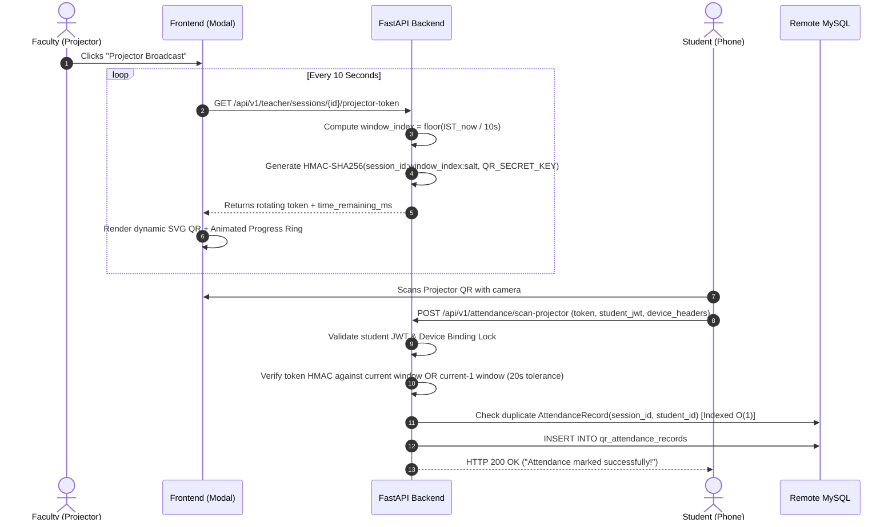
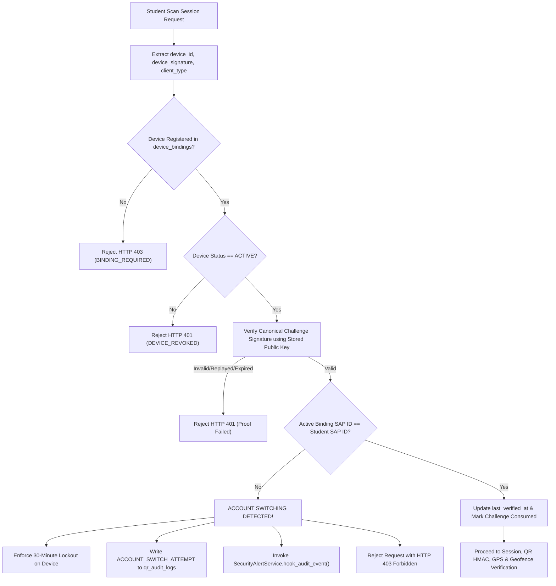
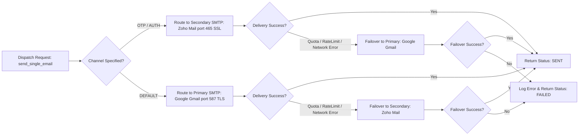
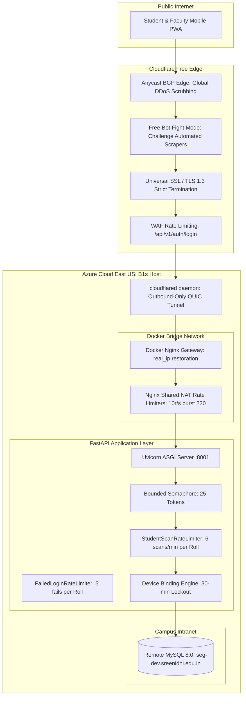

# 🏛️ System Architecture & Engineering Blueprint

This document details the software architecture, data pipelines, caching strategies, and concurrency patterns powering the **SNIST AI QR Attendance & ERP System**.

---

## 1. High-Level Architectural Patterns

The system adheres to standard enterprise architectural principles:
1. **Stateless API Gateway Pattern**: The FastAPI backend maintains no in-memory user sessions. All authentication state is encapsulated in cryptographically signed JWT tokens and server-authoritative database bindings.
2. **Event-Driven Security Observability**: Any security-relevant request (failed token HMAC, account switch, rate limit breach, privilege escalation) is recorded to an append-only audit trail (`qr_audit_logs`) and dispatched asynchronously to the alert engine.
3. **Defense-in-Depth & Non-Blocking Isolation**: All external network I/O (SMTP email dispatch, Google Sheets API synchronization, Frappe ERP webhooks) is strictly isolated behind thread pools or FastAPI `BackgroundTasks`. An external network timeout or provider outage can **never** block or delay the student attendance scan path.

---

## 2. Classroom Rotating QR Code Pipeline

### Key Guarantees
- **Anti-Photo Sharing**: QR codes expire within 10 seconds. Even if a student photographs the screen and sends it via WhatsApp, by the time a remote student receives and scans it, the server rejects it as expired.
- **Clock Drift Tolerance**: Server calculates valid HMAC signatures for both window $W_t$ and window $W_{t-1}$, granting legitimate students in the classroom a seamless 20-second submission window.

---

## 3. Cryptographic Device Identity & Account Switching Lockout

---

## 4. Two-Layer Security Alerting Engine

The alerting engine guarantees that critical incidents reach the operator immediately without alert fatigue:

### Layer 1: In-Memory Sliding TTL Tracker (`SecurityAlertTracker`)
- Maintained as a thread-safe in-memory structure protected by `threading.Lock()`.
- Keyed on `(event_type, subject_id, source_id)`.
- Evicts timestamps older than the sliding window (e.g. 10 minutes for account switching, 5 minutes for HMAC failures).
- Once threshold $N$ is reached, the alert is triggered and a **10-minute cooldown timer** is activated for that key.
- Subsequent violations during the cooldown increment a **suppressed event counter** instead of sending duplicate emails.

### Layer 2: Hourly Digest Bot (`_hourly_security_digest_scheduler`)
- Scheduled via native Python `asyncio` task started during FastAPI `lifespan`.
- Wakes up every 60 minutes.
- Checks operating schedule: **09:00 to 17:00 IST on Weekdays**. If outside window, skips execution.
- Queries `qr_audit_logs` for `created_at >= NOW() - 1 HOUR`.
- If zero events are found, it terminates silently (zero spam).
- If incidents occurred, it flushes the suppressed event counters from Layer 1 and sends a formatted HTML digest table to `SECURITY_ALERT_EMAIL`.

---

## 5. Dual-Channel SMTP Transport & Failover

---

## 6. SRE Database Index Topology

To support 1,000+ simultaneous students scanning during morning class transitions without database exhaustion, 15 specialized B-tree indexes were provisioned on remote MySQL:

| Table | Index Name | Columns Indexed | Purpose |
| :--- | :--- | :--- | :--- |
| `device_account_bindings` | `idx_dev_bind_lookup` | `(device_id, binding_status, expires_at)` | Eliminates full table scan on 30-min device lockout check |
| `device_account_bindings` | `idx_dev_bind_user` | `(user_id, binding_status)` | Instant resolution of student active device bindings |
| `attendance_records` | `idx_att_rec_session_student` | `(session_id, student_id)` | Constant-time $O(1)$ duplicate attendance check |
| `attendance_records` | `idx_att_rec_student` | `(student_id, created_at)` | Fast aggregation for student monthly attendance percentages |
| `students` | `idx_student_section` | `(section_id)` | Eliminates table scans during classroom roster resolution |
| `students` | `idx_student_roll` | `(roll_number)` | $O(1)$ student lookup during HMAC and batch scanning |
| `qr_audit_logs` | `idx_audit_created_at` | `created_at` | High-speed range queries for hourly security digest |
| `qr_audit_logs` | `idx_audit_event_type` | `event_type` | Filtered audit analysis on specific security incidents |

---

## 7. Edge Layer & Cloudflare Ingress Architecture

---

## 8. Perimeter Protection vs. Application Device Binding Matrix

A critical design principle of the SNIST platform is that **Cloudflare protects the perimeter infrastructure, while application code enforces zero-trust identity and device binding**:

| Dimension | Perimeter Layer (Cloudflare Free Tier) | Application Layer (FastAPI + MySQL) |
| :--- | :--- | :--- |
| **DDoS & Volumetric Attacks** | Absorbs multi-gigabit L3/L4/L7 volumetric floods via global Anycast edge. Origin never sees traffic spikes. | Does not attempt packet scrubbing. Protects internal threadpool with `BoundedSemaphore(25)`. |
| **Bot & Scraper Defense** | Free Bot Fight Mode challenges headless bots and automated scrapers at the DNS edge. | Endpoint-level signature verification; rejects requests missing cryptographic device headers. |
| **IP Rate Limiting & NAT** | Buffers high-volume bursts from shared campus Wi-Fi (`rate=10r/s burst=220`). | Strictly relies on **Roll Number / SAP ID** for brute force locking; never locks out an entire classroom sharing an IP. |
| **Cryptographic Device Identity** | Completely agnostic to device identity (cannot access browser hardware entropy or client key storage). | **Authoritative**: Enforces Rule 6 (30-minute device-to-student lock & ECDSA P-256 proof of possession). Prevents proxy attendance and account switching without hardware fingerprinting. |
| **Rotating QR Verification** | Passthrough proxy. | **Authoritative**: Validates server-generated HMAC-SHA256 tokens within a 10s sliding window without database reads. |
| **Security Auditing** | Cloudflare Security Analytics & WAF activity log. | Comprehensive, append-only `qr_audit_logs` + real-time 2-layer email alert engine with IST operating windows. |

