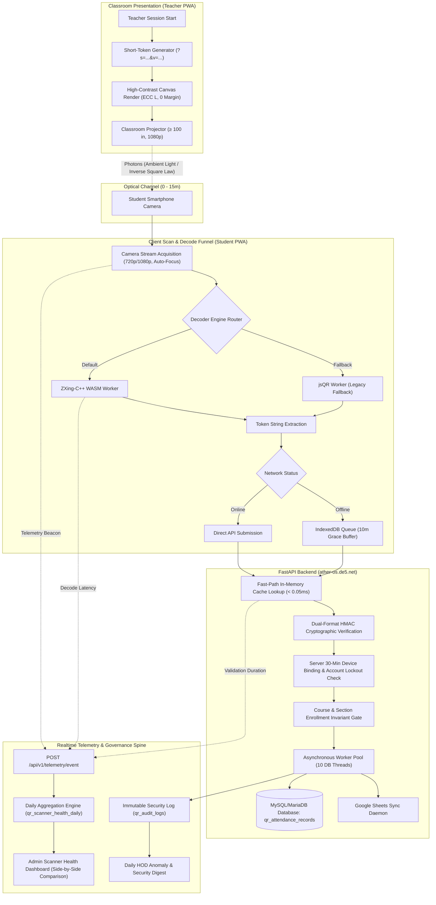

# SNIST ERP ATTENDANCE SYSTEM — ARCHITECTURE OVERVIEW (ARCHITECTURE_OVERVIEW.md)

> **Document Status**: RELEASE ACCEPTED (Week 10 Master Architecture)  
> **Classification**: Core System Design Specification  
> **Associated Artifacts**: [FINAL_CONTRACT_REPORT.md](file:///c:/Users/bhask/Desktop/att2/docs/FINAL_CONTRACT_REPORT.md), [THREAT_MODEL_FINAL.md](file:///c:/Users/bhask/Desktop/att2/docs/THREAT_MODEL_FINAL.md)

---

## 1. System Philosophy & High-Level Topology

The SNIST ERP Attendance System is an **asymmetric client-server platform** engineered to deliver rapid, low-friction attendance capture across lecture halls spanning up to 15 meters, while maintaining rigid institutional compliance and anti-proxy guarantees.



---

## 2. The Full Scan Funnel: Stage-by-Stage Breakdown

Each student scan traverses 5 distinct latency and security zones:

```
[Camera Open] ──> [Frame Acquisition] ──> [Optical Decode] ──> [Server Validation] ──> [DB Commit]
   ~180ms               ~30ms                  ~190ms                ~35ms                 ~300ms (Async)
```

### Stage 1: Display & Projection (Teacher Side)
* **Frequency**: Rotates every 10 seconds (`TOKEN_ROTATION_SECONDS=10`).
* **Format**: Crockford Base32 8-character token with rotation step (`?s=8XK2Q7MD&v=483921`).
* **Visual Optics**: 21×21 module grid, 7% ECC Level L, zero padding margin, high contrast (100% black on 100% white).

### Stage 2: Optical Capture & Lens Adaptation (Student Side)
* **Constraints**: Accommodates 15-meter hall-room distance, lens distortions, ambient glare, and low-end sensor rolling shutters.
* **Camera Ladder**: Progressive hardware negotiation: tries optimal 1080p -> 720p fallback -> single-tap 2x digital zoom for rear rows.

### Stage 3: Client Decode Engine (WASM + Fallback)
* **Primary Engine**: `zxing-cpp` compiled to WebAssembly via Emscripten. Executes in a dedicated Web Worker to prevent UI thread stuttering.
* **Secondary Engine**: `jsqr` pure JavaScript decoder, available via dynamic fallback if WASM allocation fails on legacy WebViews.

### Stage 4: Network Ingestion & Offline Resilience
* **Online**: Dispatched immediately via `POST /api/v1/student/scan-session`.
* **Offline**: Scans stored in browser `IndexedDB`. When network re-establishes, queued payloads flush with `is_offline_submission=True` within the bounded 10-minute session grace window (`SUBMIT_GRACE_MINUTES=10`).

### Stage 5: Backend Authoritative Verification
* **Step 0**: Dual rate limiting: 6 attempts/min per student roll number, 15 failed tokens/60s per IP.
* **Step 1**: In-memory token cache resolution ($< 0.05\text{ms}$).
* **Step 2**: Cryptographic HMAC-SHA256 signature verification.
* **Step 3**: 30-minute device-to-student lock enforcement (blocks proxy account switching).
* **Step 4**: Section enrollment check (prevents cross-class poaching).
* **Step 5**: Fast-path response: returns HTTP 200 to student immediately; pushes write to `AsyncAttendanceWriter` worker pool.

---

## 3. The Telemetry Spine

The attendance engine is fully observable through an automated telemetry pipeline:
1. **Sub-Second Beaconing**: PWA client fires lightweight beacons (`POST /api/v1/telemetry/event`) recording stage latencies (`camera_open_ms`, `decode_ms`, `network_ms`) and device bucket classification.
2. **Scan-Path Overhead Budget**: Instrumentation overhead is strictly verified at **$< 2.0\text{ms}$** (empirically measured at $0.03\text{ms}$).
3. **Daily Pre-Aggregation Rollup**: A background cron calculates percentiles ($p50, p95$) and success rates by device bucket, populating `qr_scanner_health_daily`.
4. **Side-by-Side Verification View**: Admin dashboard queries pre-aggregated rollups to render frozen baseline vs current production performance side-by-side with zero remote database scan latency.
