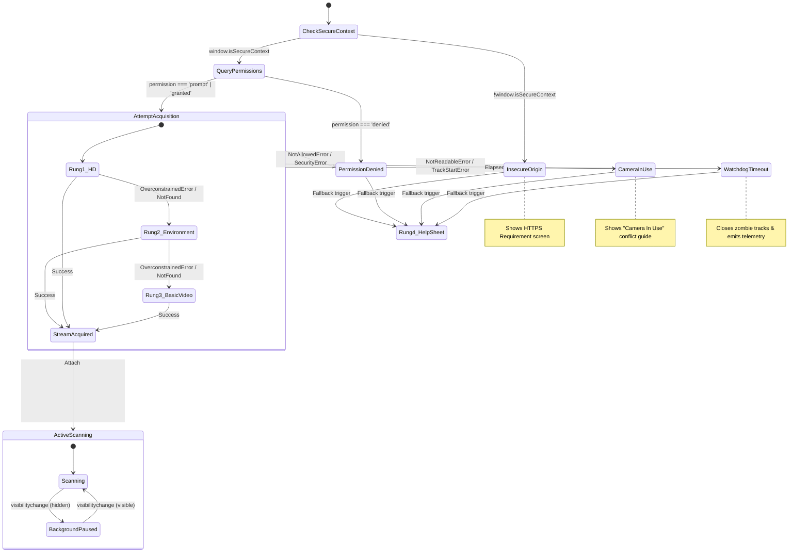

# Camera Acquisition State Machine & Hardening Specification

**System**: SNIST ERP Attendance Engine  
**Component**: Hardware MediaStream Capture & Lifecycle Controller  
**Specification Version**: 8.0 (Week 8 Release)  
**Target Hardware Range**: Low-end Android Go handsets ($< \$80$), mid-tier devices, and iOS Safari devices  

---

## 1. Overview & Architecture

Camera acquisition on modern mobile web browsers is vulnerable to silent failures: restrictive browser permission models, non-standard camera driver constraints, background tab resource revocation, hardware sensor locking by third-party apps, and insecure HTTP origins.

The **Camera Acquisition State Machine** replaces fragile `navigator.mediaDevices.getUserMedia()` calls with a resilient, observable lifecycle controller featuring:
1. Complete permission state detection (`prompt`, `granted`, `denied`, `insecure_origin`).
2. A 3-rung constraint relaxation ladder (720p HD $\to$ Environment $\to$ Basic Video).
3. An 8-second hardware watchdog timer with abort and zombie track cleanup.
4. "Camera in use" sensor conflict detection (`NotReadableError` / `TrackStartError`).
5. Foreground/background page lifecycle management (`visibilitychange`).
6. Browser-specific recovery guidance for Chrome (Android) and Safari (iOS).

---

## 2. State Machine Diagram



---

## 3. Permission State Lifecycle

### 3.1 Browser Support & Query Strategy
Browsers handle permissions queries differently:
- **Chromium / Edge / Firefox**: Support `navigator.permissions.query({ name: 'camera' as PermissionName })`. Returns `'granted'`, `'prompt'`, or `'denied'`.
- **iOS WebKit / Safari**: Does not implement `'camera'` in `permissions.query()`. Calling it throws a `TypeError`.
- **Defensive Guard**: The state machine wraps `permissions.query()` in a `try...catch`. On Safari, it defaults to `'prompt'` and probes via `getUserMedia()`.

```typescript
async function queryCameraPermission(): Promise<'granted' | 'prompt' | 'denied'> {
  if (!navigator.permissions || !navigator.permissions.query) {
    return 'prompt';
  }
  try {
    const status = await navigator.permissions.query({ name: 'camera' as PermissionName });
    return status.state;
  } catch {
    // Safari / WebKit throws on 'camera'; treat as prompt
    return 'prompt';
  }
}
```

---

## 4. 3-Rung Hardware Constraint Relaxation Ladder

Many budget Android handsets fail when applications request specific aspect ratios or resolution bounds (e.g., exact 1080p). The 3-rung ladder progressively relaxes constraints until video frames stream:

```typescript
const CAMERA_LADDER_RUNGS: MediaStreamConstraints[] = [
  // Rung 1: High-res environment camera for optimal long-range decode
  {
    video: {
      facingMode: { ideal: 'environment' },
      width: { ideal: 1280 },
      height: { ideal: 720 },
    },
    audio: false,
  },
  // Rung 2: Standard environment camera without resolution constraints
  {
    video: {
      facingMode: { ideal: 'environment' },
    },
    audio: false,
  },
  // Rung 3: Raw video stream (any available sensor, front or back)
  {
    video: true,
    audio: false,
  },
];
```

### Execution Rules:
1. The scanner begins at **Constraint Rung 1**.
2. If `getUserMedia()` throws `OverconstrainedError`, `ConstraintNotSatisfiedError`, or `NotFoundError`, the controller cleans up any dangling tracks, advances to **Rung 2**, and immediately retries.
3. If Rung 2 fails similarly, it advances to **Rung 3**.
4. Telemetry records the final successful `camera_ladder_rung` (`1`, `2`, or `3`).

---

## 5. 8-Second Watchdog Timer & Zombie Track Cleanup

A known failure mode on low-RAM handsets is driver hang: `navigator.mediaDevices.getUserMedia()` returns a `Promise` that **never resolves or rejects**, freezing the browser's UI thread in an endless spinner.

### Watchdog Implementation:
1. Upon calling `getUserMedia()`, the modal sets an 8,000 ms timer.
2. A visible spinner informs the user:  
   `"Starting camera... (Taking longer than usual? [Cancel & Switch to Manual])"`.
3. If the timer expires before the stream resolves:
   - The pending operation is aborted via internal state flag.
   - Any background stream tracks received subsequently are immediately stopped:
     ```typescript
     stream.getTracks().forEach((track) => track.stop());
     ```
   - Emits telemetry: `event_type: "camera_open_timeout"`, `stage: "camera_opened"`, `error_type: "watchdog_timeout"`.
   - Transitions directly to the **Camera Timeout Recovery View** with a 1-tap shortcut to **Rung 4: Roll Number Card**.

---

## 6. "Camera in Use" Hardware Conflict Detection

When another application (e.g., WhatsApp, Instagram, Google Meet, or a parallel browser tab) has acquired an exclusive hardware lock on the camera sensor, the browser throws specific exceptions:
- **Android / Chrome**: `NotReadableError: Could not start video source`
- **iOS / Safari**: `TrackStartError: The video stream could not start`

### Recovery Screen & UI Guidance:
Instead of a generic `"Camera error"`, the modal displays an explicit conflict screen:
> ⚠️ **Camera In Use by Another App**  
> Another app (or browser tab) is currently using your camera.  
> 1. Close background apps (camera, video calling, social media).  
> 2. Close any other open browser tabs.  
> 3. Return here and tap **"Retry Camera"**, or tap **"Can't Scan? Show Roll Card"**.

---

## 7. Insecure Origin Handling (`!isSecureContext`)

WebRTC and MediaStreams strictly require a Secure Context (HTTPS or localhost). If a student accesses the portal via plain HTTP (e.g., local IP address `http://192.168.1.50:5173`), `navigator.mediaDevices` is undefined or throws `SecurityError`.

### Pre-Flight Verification:
```typescript
if (!window.isSecureContext) {
  setCameraState('insecure_origin');
  recordScanEvent('insecure_origin', 'camera_opened', {
    error_type: 'insecure_origin',
    details: { origin: window.location.origin }
  });
  return;
}
```
The student is shown an actionable screen directing them to the secure HTTPS institutional domain.

---

## 8. Page Lifecycle & Backgrounding Handling (`visibilitychange`)

When a student switches away from the browser (e.g., to look up credentials or answer a notification), holding active camera sensor locks drains battery, causes thermal throttling, and triggers WebKit crashes.

### Lifecycle Listener:
```typescript
useEffect(() => {
  const handleVisibilityChange = () => {
    if (document.hidden) {
      // Pause scanner processing loop and mark paused
      isPausedRef.current = true;
    } else {
      // Resume scanning seamlessly when tab returns to foreground
      isPausedRef.current = false;
      requestAnimationFrame(scanLoop);
    }
  };

  document.addEventListener('visibilitychange', handleVisibilityChange);
  return () => document.removeEventListener('visibilitychange', handleVisibilityChange);
}, []);
```

---

## 9. Browser-Specific Permission Recovery Instructions

When a user permanently denies camera permissions, browsers will not re-prompt via `getUserMedia()`. The modal detects `NotAllowedError` / `permission === 'denied'` and renders OS/browser-specific recovery paths:

### 9.1 Chrome on Android
1. Tap the **Lock / Tune icon** (`🔒` or `⚙️`) in the browser URL bar.
2. Tap **Permissions** $\to$ **Camera**.
3. Toggle setting from **Blocked** to **Allow**.
4. Refresh the page or tap **"I've Allowed It — Try Again"**.

### 9.2 Safari on iOS
1. In the Safari address bar, tap the **`Aa`** or **Page Settings** icon on the left.
2. Select **Website Settings**.
3. Tap **Camera** and choose **Allow** (or **Ask**).
4. Tap **Done** and refresh the page.
*(Alternative: Open iOS **Settings** $\to$ **Safari** $\to$ **Camera** $\to$ select **Allow**).*
