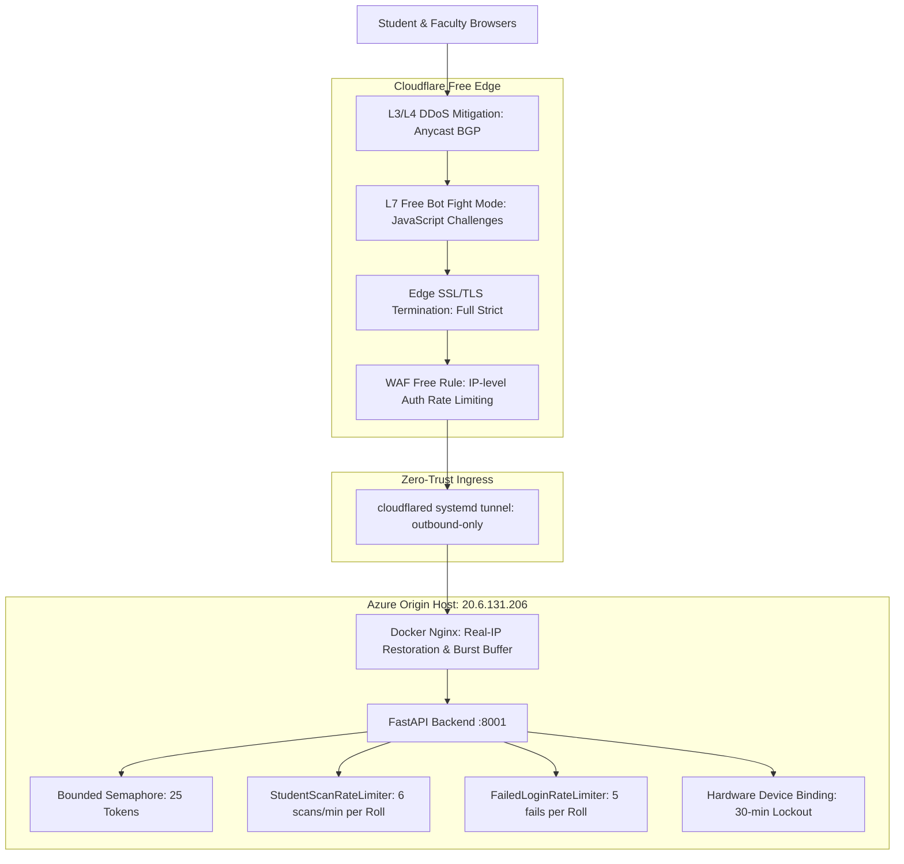

# 🚀 Cloudflare Migration & Operations Runbook

**System**: SNIST AI QR Attendance & ERP Platform  
**Target Domain**: `ather-os.de5.net`  
**Origin Infrastructure**: Azure B1s Ubuntu VM (`20.6.131.206`), FastAPI (:8001), Docker Nginx Proxy, Remote MySQL 8.0 (`seg-dev.sreenidhi.edu.in`)  
**Cloudflare Tier**: Free Plan Verified  

---

## 1. Executive Summary & Architecture

This runbook guides DevOps engineers through cutting over the production gateway (`ather-os.de5.net`) behind Cloudflare’s Edge network without breaking the PWA client, student device binding, rotating HMAC QR code verification, or security alert dispatching.

### Architectural Responsibility Boundary



### Perimeter vs. Application Binding Matrix

| Security Layer | Handled By | Mechanism | Operational Guarantee |
| :--- | :--- | :--- | :--- |
| **Volumetric DDoS** | Cloudflare Edge | BGP Anycast scrubbing | Origin CPU/network never sees flood packets |
| **Edge TLS** | Cloudflare Edge | Universal SSL (Full Strict) | Modern TLS 1.3 encryption with HTTP/2 & HTTP/3 |
| **Automated Scrapers** | Cloudflare Edge | Free Bot Fight Mode | Challenge non-browser automated HTTP agents |
| **Origin Cloaking** | Cloudflare Tunnel | Outbound-only QUIC tunnel | Inbound ports 80 & 443 on Azure VM closed |
| **IP Restoration** | Nginx (`real_ip`) | `CF-Connecting-IP` header | Audit logs & per-IP limits receive client true IP |
| **Shared NAT Buffer** | Nginx (`limit_req`) | `rate=10r/s burst=220 nodelay` | 200 students sharing campus Wi-Fi pass without drops |
| **Brute-Force Auth** | FastAPI Backend | `FailedLoginRateLimiter` | Locks account after 5 consecutive bad passwords |
| **Scripted Scan Flood**| FastAPI Backend | `StudentScanRateLimiter` | Caps single student to 6 scans/min; classroom unaffected |
| **Device Binding** | FastAPI Backend | `device_account_bindings` | 30-minute hardware lock; rejects account switching |
| **Anti-Proxy QR** | FastAPI Backend | Server HMAC + 10s Window | Rotating token invalidates within 10s; 0 DB queries |

---

## 2. Cloudflare Dashboard Manual Configuration

Log in to the [Cloudflare Dashboard](https://dash.cloudflare.com) with the account managing `de5.net`.

### Step 2.1: DNS Proxy Configuration
1. Navigate to **DNS** -> **Records**.
2. Locate or create the record for `ather-os`:
   - **Type**: `CNAME` (if using Cloudflare Named Tunnel) pointing to `<tunnel-id>.cfargotunnel.com`  
     *OR*
   - **Type**: `A` pointing to `20.6.131.206`.
3. Ensure the **Proxy status** toggle is set to **Proxied (Orange Cloud)**.
4. Set **TTL** to **Auto**.

### Step 2.2: SSL/TLS Encryption Mode
1. Navigate to **SSL/TLS** -> **Overview**.
2. Select **Full (strict)**.
   > **Why Strict?** The Azure VM origin already has a valid Let's Encrypt certificate managed by Certbot (`/etc/letsencrypt/live/ather-os.de5.net/`). Full (strict) guarantees end-to-end encryption between Cloudflare Edge and the Azure origin, preventing man-in-the-middle interception.
3. Under **SSL/TLS** -> **Edge Certificates**:
   - Enable **Always Use HTTPS** (HTTP -> HTTPS redirect).
   - Minimum TLS Version: **TLS 1.2**.
   - Enable **Opportunistic Encryption** and **TLS 1.3**.

### Step 2.3: Bot Fight Mode (Free Tier)
1. Navigate to **Security** -> **Bots**.
2. Toggle **Bot Fight Mode** to **ON**.
   > **Free Tier Verification**: Free Bot Fight Mode challenges automated scrapers and malicious bots using JavaScript / Managed Challenges before they reach the Azure VM. Legitimate browsers (Chrome, Safari, Firefox) on Android and iOS complete this transparently.

### Step 2.4: WAF Rate Limiting Rule (Free Tier: 1 Allowed Rule)
Cloudflare Free tier includes exactly **1 custom rate limiting rule**. We allocate this rule to safeguard the authentication endpoint against credential stuffing from outside networks:
1. Navigate to **Security** -> **WAF** -> **Rate limiting rules**.
2. Click **Create rule**:
   - **Rule name**: `Protect Auth Login NAT Safe`
   - **Field**: `URI Path` | **Operator**: `equals` | **Value**: `/api/v1/auth/login`
   - **Rate limit settings**:
     - Requests: `250` requests
     - Period: `10 seconds`
     - Action: `Managed Challenge` or `Block (1 minute)`
3. Save and Deploy.
   > **AM-200 Safety**: A classroom of 200 students logging in at 09:00 IST produces 200 requests within 10–60s. Setting the threshold at 250 requests / 10s prevents false-positive lockouts on the campus NAT IP while instantly trapping distributed brute-force scripts.

### Step 2.5: Network & WebSockets
1. Navigate to **Network**.
2. Ensure **WebSockets** is toggled **ON** (needed for live telemetry and real-time dashboard updates).
3. Ensure **gRPC** and **HTTP/3 (with QUIC)** are toggled **ON** for mobile latency reduction.

---

## 3. Emergency SOP: "Under Attack Mode"

If the platform experiences an active, overwhelming Layer 7 HTTP flood or DDoS attack during school hours:

### When to Activate
- The Azure B1s VM load average spikes $> 5.0$.
- Error rates on the gateway spike with HTTP 502/504.
- Network bandwidth or request rates spike exponentially from distributed global IPs.

### How to Activate
1. Open Cloudflare Dashboard -> `de5.net`.
2. On the **Overview** dashboard (right side panel), locate **Quick Actions**.
3. Toggle **Security Level** -> select **I'm Under Attack!**.
   *Alternatively, in **Security** -> **Settings**, set Security Level to "High" or "I'm Under Attack!".*

### Operational Impact & Warning
> [!WARNING]
> **MORNING CLASS RUSH ADVISORY**:  
> "I'm Under Attack" mode forces an interstitial 5-second Cloudflare JavaScript challenge page for every new browser visiting the domain.  
> **DO NOT** leave "Under Attack Mode" permanently active during normal operations. At 09:00 IST, 200 students opening the PWA simultaneously will see a Cloudflare waiting room, which can cause classroom confusion.  
> **Deactivate** Under Attack Mode (return to Security Level: **Medium**) immediately once the attack subsides.

---

## 4. Azure NSG Firewall Lockdown (Zero-Trust Origin Cloaking)

When running via Cloudflare Named Tunnel (`cloudflared`), the Azure VM does not need any public inbound HTTP/HTTPS ports open to the public internet. The tunnel initiates outbound connections over QUIC/HTTPS to Cloudflare Edge.

### Step 4.1: Verify Cloudflare Tunnel Status on Azure VM
```bash
# Check tunnel service health
sudo systemctl status cloudflared

# Check tunnel active connections
journalctl -u cloudflared -n 30 --no-pager
```

### Step 4.2: Azure Network Security Group (NSG) Inbound Rules
Navigate to Azure Portal -> **Virtual Machines** -> `Ather-os` -> **Networking**:
1. **Port 22 (SSH)**: Keep restricted to authorized administrative IPs or Azure Bastion.
2. **Port 80 (HTTP)**: Set to **Deny** or remove inbound rule.
3. **Port 443 (HTTPS)**: Set to **Deny** or remove inbound rule.

> [!NOTE]
> If maintaining direct A-record fallback alongside the tunnel, restrict Inbound Ports 80 & 443 to **Cloudflare IP ranges only** ([https://www.cloudflare.com/ips/](https://www.cloudflare.com/ips/)) instead of `0.0.0.0/0`.

---

## 5. 60-Second Instant Rollback SOP

If any unexpected edge failure, SSL mismatch, or captive portal interaction occurs during the pilot cutover, execute this instant rollback:

### Option A: Cloudflare Edge Proxy Bypass (Instant DNS Rollback)
1. Log in to [dash.cloudflare.com](https://dash.cloudflare.com).
2. Go to **DNS** -> **Records**.
3. Locate `ather-os`.
4. Click **Edit**, toggle **Proxy status** from **Orange Cloud (Proxied)** to **Grey Cloud (DNS only)**.
5. Click **Save**.
   > **TTL Execution**: Cloudflare DNS changes propagate globally within **30 to 60 seconds**. Client traffic will bypass Cloudflare Edge and route directly to Azure VM Nginx over Let's Encrypt SSL.

### Option B: Cloudflare Tunnel Fail-Open to Direct A-Record
If the Cloudflare Tunnel daemon fails:
1. Edit DNS record `ather-os`: change type to `A`, value `20.6.131.206`.
2. Toggle Proxy Status to **Grey Cloud (DNS only)**.
3. On Azure VM, ensure Nginx container is running:
   ```bash
   docker restart aether_proxy
   ```
4. Restore Azure NSG Port 443 rule if previously restricted.

---

## 6. Pre-Flight & Post-Migration Verification Checklist

Before and after the migration cutover, execute the following verification suite:

- [ ] **Real-IP Restoration**:
  ```bash
  curl -I -H "CF-Connecting-IP: 103.212.144.10" https://ather-os.de5.net/api/v1/health
  # Check /home/azureuser/aetheros/logs/access.log on VM to verify client IP is 103.212.144.10, not Cloudflare edge IP.
  ```
- [ ] **PWA Asset & Manifest Delivery**:
  - Open `https://ather-os.de5.net` in Chrome and Safari mobile.
  - Verify Service Worker registers cleanly without cache poisoning.
  - Verify `manifest.webmanifest` returns HTTP 200 with MIME `application/manifest+json`.
- [ ] **AM-200 Burst Acceptance Suite**:
  ```bash
  python scripts/load_test_200_students.py
  ```
  - Pre-burst free+swap memory $\ge 300\text{ MB}$.
  - 200 logins from single NAT IP succeed 100% (0 rate-limited).
  - 200 scans from single NAT IP succeed 100% (0 rate-limited).
  - p95 scan latency $\le 8.0\text{ s}$.
  - Measured scan throughput $\ge 8.0\text{ scans/s}$.
- [ ] **Hardware Device Binding Integrity**:
  - Test student login from Device A $\to$ Success.
  - Test second student login on Device A $\to$ HTTP 403 Forbidden ("Account switching locked").
- [ ] **Security Alert Email Delivery**:
  - Verify hourly digest bot dispatches at designated IST window.
