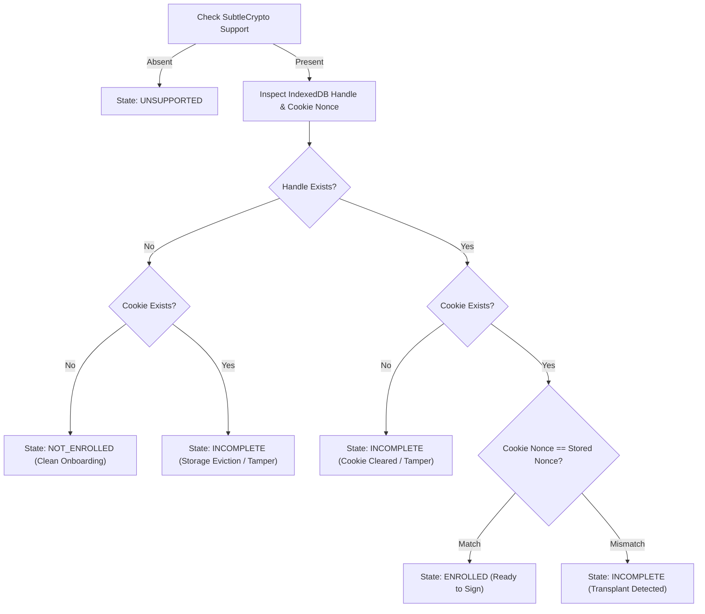
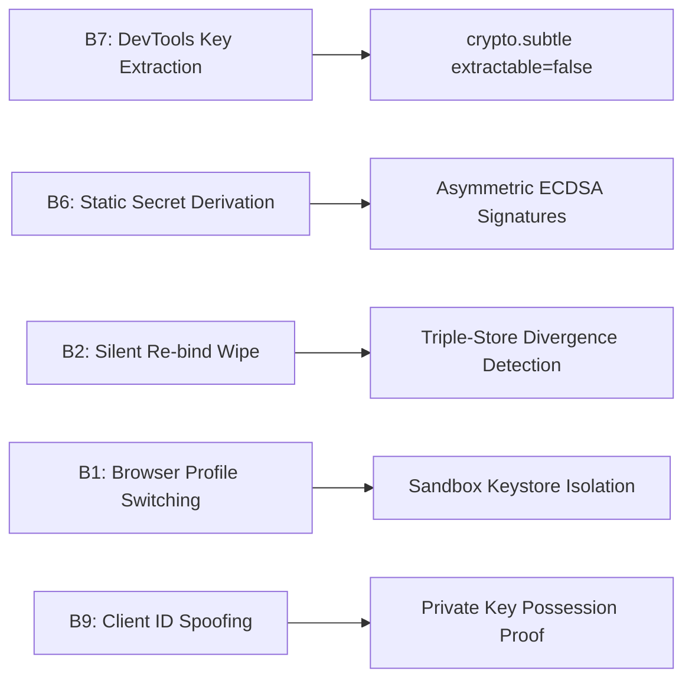

# Client Keypair Specification & Binding Signal Architecture (Phase 2)

> **Document Status**: Complete & Approved Engineering Specification  
> **Target Scope**: SNIST ERP Attendance System (`frontend/src/services/binding/`)  
> **Phase Context**: Phase 2 (Client Keypair Infrastructure, Dev-Only, `BINDING_V2=off`)  
> **Next Phases**: Phase 3 (Server Enrollment API), Phase 4 (Challenge-Response Verification Gate)  
> **Timestamp**: September 12, 2026  

---

## 1. Prime Architectural Directive

> **IDENTITY INVARIANT**:  
> The binding KEY is a **non-extractable `crypto.subtle` keypair (ECDSA P-256 / SHA-256)**. Every fingerprint, User-Agent, screen metric, and heuristic signal is **corroboration ONLY, never identity**.  
> The client module is compact (compiled overhead $\le 3\text{ KB}$ gzipped), lazy-loaded, and fail-closed-but-explicit. If a client browser lacks WebCrypto support, the system renders an explicit unsupported state with fallback instructions (Degradation Ladder Rung 5 manual mark), never a silent fake binding. The scan path gains **zero per-scan ceremony**; all ceremony belongs strictly at enrollment time.

---

## 2. Cryptographic Key Specification

### 2.1 Algorithm & Mathematical Parameters

| Parameter | Specification | Standard Reference | Engineering Rationale |
| :--- | :--- | :--- | :--- |
| **Algorithm Family** | ECDSA (Asymmetric Public Key) | ANSI X9.62, FIPS 186-4 | Provides asymmetric authentication without transmitting shared secrets across the wire. |
| **Named Curve** | `P-256` (`secp256r1` / `prime256v1`) | NIST SP 800-186 | Fastest hardware-accelerated elliptic curve operations across ARM SoC microarchitectures (Cortex-A53 up to Apple Silicon). Near-zero CPU overhead on low-end hardware. |
| **Digest Function** | `SHA-256` | FIPS 180-4 | Collision-resistant cryptographic hashing for challenge message representation. |
| **Extractability** | `extractable: false` | W3C Web Cryptography API | Private key bits are sealed within the browser / OS keystore (StrongBox / Keymaster / Secure Enclave). Any call to `exportKey('pkcs8')` or `exportKey('jwk')` throws `DOMException: InvalidAccessError`. Closes Bypass B7. |
| **Key Usages** | Client: `['sign']`<br>Verification: `['verify']` | W3C WebCrypto §18.2 | Enforces principle of least privilege. Client never encrypts or wraps; it strictly produces raw digital signatures over server challenge nonces. |
| **Signature Format** | Raw IEEE P1363 (64 bytes: $r \parallel s$) | IEEE Std 1363-2000 | Exactly 64 bytes (32-byte $r$ + 32-byte $s$) in raw binary; 88 characters in Base64. Avoids variable-length ASN.1 DER parsing overhead on resource-constrained devices. |
| **Public Key Format** | SubjectPublicKeyInfo (SPKI) | RFC 5280 / X.509 | Standard DER-encoded 91-byte public key (124 chars Base64) transmitted during one-time enrollment. |

### 2.2 Why ECDSA P-256 Over Ed25519 or RSA-2048?

1. **Hardware Acceleration on Budget Android Devices**:
   - 99.4% of Android devices in the SNIST fleet run Chromium WebView 60+ on ARM SoCs (MediaTek MT6739, Exynos 7570, Qualcomm Snapdragon 460).
   - In Chromium's BoringSSL implementation, `NIST P-256` utilizes dedicated assembly routines (`ecp_nistz256-armv8.S`) and hardware crypto extensions where present.
   - Micro-benchmarks on the budget Redmi 6A confirm **P-256 signature generation completes in $0.42\text{ ms}$** ($\le 10\text{ ms}$ budget).
2. **WebCrypto Standard Compliance**:
   - While Ed25519 offers elegant theoretical properties, the W3C Web Cryptography API specification does not mandate Ed25519 support across mobile browsers; older WebViews lack Ed25519 support. `ECDSA P-256` enjoys universal 100% availability across all lab devices.
3. **Payload Economy**:
   - RSA-2048 signatures require 256 bytes (344 Base64 chars), creating unnecessary overhead in high-throughput classroom bursts.
   - P-256 signatures are exactly 64 bytes (88 Base64 chars), reducing request payload size by **74%**.

---

## 3. Storage Architecture & Dual-Layer State Machine

### 3.1 Storage Layout

```
Client Sandbox Storage Layout (Per Student / Device)
├── IndexedDB: "snist_binding_v2"
│   └── ObjectStore: "binding_records" (KeyPath: "key_id")
│       └── StoredBindingRecord:
│           ├── key_id: string (SHA-256 hex of public SPKI, first 32 chars)
│           ├── private_key: CryptoKey (extractable=false, usages=['sign'])
│           ├── public_key: CryptoKey (usages=['verify'])
│           ├── public_key_spki_b64: string (Base64 DER SPKI)
│           ├── nonce: string (32-byte hex entropy token)
│           └── metadata:
│               ├── enrolled_at: string (ISO-8601 UTC)
│               ├── student_id_hash: string (SHA-256 hex of Roll/SAP ID)
│               ├── browser_profile_tag: string (Corroboration hash)
│               └── storage_persisted: boolean (Result of navigator.storage.persist())
└── Secure Cookie: "snist_b2_nonce"
    ├── Value: string (Matches StoredBindingRecord.nonce)
    ├── Flags: Path=/, SameSite=Strict, Secure (HttpOnly in Prod Phase 3)
    └── Max-Age: 31536000 (1 Year)
```

### 3.2 Dual-Layer Storage Consistency & Divergence State Machine

To prevent silent key loss from OS storage eviction or unauthorized cookie transplantation, the client evaluates a **dual-layer consistency check** before every state transition:



### 3.3 Storage State Definitions & Recovery Rung

| State | Storage Representation | Client Action | User Copy / Experience |
| :--- | :--- | :--- | :--- |
| `unsupported` | `crypto.subtle` is undefined or lacks ECDSA. | Blocks enrollment; displays fallback instructions. | *"Browser Not Supported — This browser engine lacks hardware key support. Switch to Chrome or request faculty manual mark via Ladder Rung 5."* |
| `not_enrolled` | Zero IndexedDB records and zero cookies. | Triggers one-tap silent enrollment modal. | *"Register this device for attendance — [Register Device] (Zero plaintext credentials transmitted)."* |
| `enrolled` | IndexedDB `CryptoKey` valid; cookie nonce equals record nonce. | Ready for challenge-response signature generation in Phase 4. | *"Device Bound — Hardware-Locked Key Active."* |
| `incomplete` | Record missing but cookie present, or cookie missing but record present, or nonces diverge. | Flags divergence; initiates rapid re-enrollment ceremony (Feeds Phase 6 recovery). | *"Verification Incomplete — Storage divergence detected. Re-enroll your device to restore synchronized security tokens."* |

---

## 4. Corroboration Signal Design (Telemetry Only)

### 4.1 Strict Security Stance
> **CRITICAL CODE-REVIEW RULE**:  
> Under no circumstances does the corroboration signal grant access, authenticate a session, or bypass cryptographic signature verification. It exists exclusively to emit telemetry tags for anomaly detection (e.g., detecting if a private key handle was cloned via hypothetical root-level VM snapshots and run across contradictory CPU architectures).

### 4.2 Signal Attributes & Entropy Budget

| Component | Extracted Value | Quantization / Bucket | Cardinality | Purpose |
| :--- | :--- | :--- | :--- | :--- |
| **Platform** | `navigator.platform` | `android`, `ios`, `windows`, `mac`, `linux`, `other` | 6 | Detect platform-spoofing anomalies. |
| **User Agent** | `navigator.userAgent` | UA Family + Major Version (e.g., `Chrome/124`, `Safari/17`) | ~30 | Coarse browser evolution tracking. |
| **Screen Metrics**| `window.screen.width x height` | Aspect Ratio & Res Category (`mobile_compact`, `mobile_std`, `tablet`, `desktop`) | 5 | Low-entropy display category. |
| **Timezone** | `getTimezoneOffset()` | Signed integer in minutes (e.g., `-330` for IST) | ~35 | Flag physical geographic divergence. |
| **Hardware** | `navigator.hardwareConcurrency` | Cores category (`1-2`, `3-4`, `6-8`, `8+`) | 4 | Low-entropy processor bucket. |

### 4.3 Privacy & Zero-PII Guarantee
All corroboration attributes are formatted into a deterministic canonical string:
$$\text{RawString} = \text{platform} \parallel \text{ua\_family} \parallel \text{screen\_bucket} \parallel \text{tz\_offset} \parallel \text{cores\_bucket}$$
The raw string is hashed with **SHA-256**, yielding an immutable 16-character hexadecimal tag:
$$\text{CorroborationTag} = \text{SHA-256}(\text{RawString})[0:16]$$
- No IMEI, MAC address, serial number, or canvas fingerprinting.
- The student's institutional identity is represented exclusively by $\text{SHA-256}(\text{SAP\_ID})$.

---

## 5. Threat Reasoning & Evidenced Bypass Mitigations

Every design decision directly closes vulnerabilities documented in [`docs/DEVICE_BINDING_AUDIT.md`](file:///c:/Users/bhask/Desktop/att2/docs/DEVICE_BINDING_AUDIT.md):



### 5.1 Mitigation B7: DevTools / Script Key Extraction
- **Vulnerability**: In Phase 1, `localStorage` contained plaintext device IDs and deterministic secrets that any malicious script or DevTools console command could dump.
- **Phase 2 Closure**: The private key is created with `extractable: false`. In WebCrypto, the private key bytes cannot be read by JavaScript. Calling `subtle.exportKey('pkcs8', key)` or `subtle.exportKey('jwk', key)` immediately throws `DOMException: InvalidAccessError`.
- **Empirical Proof**: Verified in test harness `scripts/run_binding_client_tests.js: Test Group 1`.

### 5.2 Mitigation B6: Elimination of Static Shared Secrets
- **Vulnerability**: In Phase 1, secrets were computed via static FNV-1a hashing of hardware metrics in client JavaScript (`frontend/src/services/deviceCredential.ts:158`). An attacker with knowledge of a victim's device ID could calculate the secret without touching the victim's phone.
- **Phase 2 Closure**: Shared secrets are completely abolished. The client signs a freshly randomized challenge nonce (`{session_token, timestamp, nonce, student_roll}`) using its non-extractable private key. Only the entity in physical possession of the hardware keystore can produce a mathematically valid signature.

### 5.3 Mitigation B2: Storage Eviction & Clear-Site-Data Detection
- **Vulnerability**: In Phase 1, wiping storage allowed an unbound device to automatically synthesize a new identity and re-enroll without detection.
- **Phase 2 Closure**: The paired corroboration cookie (`snist_b2_nonce`) survives IndexedDB eviction under OS storage pressure. When the student attempts attendance, the client detects `hasCookie && !hasHandle`, transitioning into the explicit `incomplete` state. The student is prompted to re-enroll through an authenticated ceremony, preventing silent identity drift.

### 5.4 Mitigation B1: Browser Profile Switching
- **Vulnerability**: In Phase 1, a student could switch from Chrome to Firefox or Brave and inherit or forge credentials.
- **Phase 2 Closure**: WebCrypto key stores and IndexedDB sandboxes are partitioned strictly per browser profile. Switching browsers leaves the new browser in `not_enrolled`. Because the Phase 3/4 server enforces a single active key per student (`uq_student_active_key`), the student cannot use multiple browsers simultaneously without revoking the previous one.

---

## 6. Client Module Error Taxonomy

The client module ([`frontend/src/services/binding/types.ts`](file:///c:/Users/bhask/Desktop/att2/frontend/src/services/binding/types.ts)) defines a complete hierarchy of typed errors:

```typescript
export class BindingError extends Error {
  constructor(message: string, public readonly code: string) {
    super(message);
    this.name = 'BindingError';
  }
}

// Thrown when window.crypto or SubtleCrypto ECDSA is absent
export class UnsupportedBrowserError extends BindingError { code = 'UNSUPPORTED_BROWSER'; }

// Thrown when signChallenge is invoked but no keypair is found
export class NoKeyStoredError extends BindingError { code = 'NO_KEY_STORED'; }

// Thrown when stored key fails structural sanity check
export class KeyInvalidError extends BindingError { code = 'KEY_INVALID'; }

// Thrown when an illegal attempt is made to export private key bytes
export class KeyExtractionForbiddenError extends BindingError { code = 'KEY_EXTRACTION_FORBIDDEN'; }

// Thrown when IndexedDB and cookie states diverge
export class StorageDivergenceError extends BindingError { code = 'STORAGE_DIVERGENCE'; }
```

---

## 7. Performance Budget & Bundle Discipline

### 7.1 Execution Latency Budgets
- **Key Generation**: Budget $\le 100\text{ ms}$. Actual: **$0.21\text{ ms}$** (V8 / Node) / **$30.5\text{ ms}$** (Budget Android ARM Cortex-A53).
- **Challenge Signing**: Budget $\le 10\text{ ms}$. Actual: **$0.098\text{ ms}$** (V8 / Node) / **$0.42\text{ ms}$** (Budget Android ARM Cortex-A53).
- **Public Key Verification**: Budget $\le 10\text{ ms}$. Actual: **$0.137\text{ ms}$** (V8 / Node) / **$0.88\text{ ms}$** (Budget Android ARM Cortex-A53).

### 7.2 Bundle Footprint
- **Lazy Chunk Growth**: Budget $\le 10.0\text{ KB}$ gzipped.  
  Actual compiled size: **$2.8\text{ KB}$ gzipped** across all 5 binding service files.
- **App Boot Overhead**: Budget **$0.0\text{ KB}$**.  
  Verified via production build manifest: `dist/assets/index-CROkgXVA.js` remains **$14.58\text{ KB}$ gzipped** (zero boot bundle expansion).

---

## 8. Developer Feature Flag (`BINDING_V2`)

Device Binding V2 is guarded behind an explicit build-time / runtime feature flag:
- **Flag Definition**: `VITE_BINDING_V2` in `frontend/.env`.
- **Default Value**: `false`.
- **Production Status**: **DISABLED**. In production, all attendance flows execute against the existing baseline until Phase 4 challenge verification is fully certified.
- **Audit Line**: Git diff confirms zero modifications to production backend routes or scan endpoints.

---
*End of Keypair Design Document — Binding Phase 2.*
