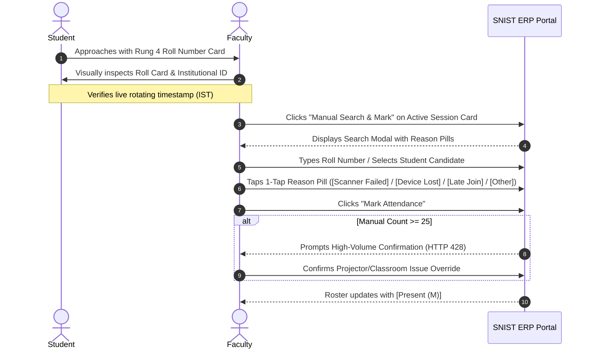
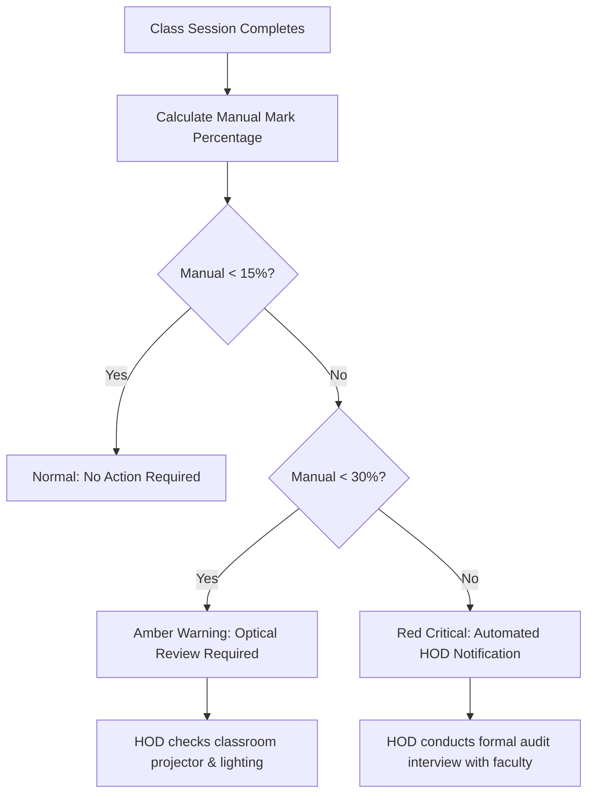

# Operational Runbook: Manual-Mark Procedures & Classroom Recovery SOP

**System**: SNIST ERP Attendance Engine  
**Runbook ID**: RB-OPS-008  
**Audience**: Teaching Faculty, Students, Department Heads (HODs), and ERP System Administrators  
**Version**: 8.0 (Week 8 Release)  

---

## 1. Purpose & Scope

This runbook establishes standard operating procedures (SOP) for resolving QR scanning failures in live SNIST lecture halls. It ensures that students experiencing technical issues are never unfairly marked absent, while guaranteeing that anti-proxy security controls, reason tracking, and rate-limit guardrails are rigorously upheld.

---

## 2. In-Class Faculty Standard Operating Procedure (SOP)

When a student reports an inability to scan the projected QR code during an active lecture, faculty must execute the following 4-step workflow:

### Step 1: Request Rung 4 Roll Number Card
1. Ask the student to open the **Help Sheet** in their scanner modal and tap **"Show Roll Card to Faculty"**.
2. **Visual Verification Checklist**:
   - **Roll Number & Name**: Matches the student's physical institutional ID badge.
   - **Live Timestamp**: Verify the rotating digital clock in the card header matches the current room clock (`IST Asia/Kolkata`). This prevents students from showing static screenshots sent by absent peers.

### Step 2: Open Manual Search in Teacher Portal
1. On your smartphone or laptop running the `TeacherDashboard`, locate the active lecture card.
2. Click the blue button: **`[ 🔍 Manual Search & Mark ]`**.
3. A search modal appears with an instant-filter roll number box and 1-tap Reason Pills.

### Step 3: Select Candidate & Choose Operational Reason
1. Type the last 3–4 digits of the student's roll number (e.g., `501`).
2. Click the matching student result.
3. Select the appropriate **Reason Pill**:
   - **`[ Scanner Failed ]`**: Use when the student's phone camera could not focus, suffered glare, or failed decoding.
   - **`[ Device Lost ]`**: Use when the student has no phone (battery dead, left at home, or broken screen).
   - **`[ Late Join ]`**: Use when the student entered after the QR broadcast ended, with your permission.
   - **`[ Other Reason ]`**: Exceptional circumstances (enter a short explanation in the detail box).
4. Click **`[ Mark Present ]`**. The modal confirms success in $< 200\text{ ms}$.

### Step 4: Responding to the 25-Mark Limit Alert (HTTP 428)
If you have marked **25 students manually** in a single lecture, the portal displays a warning modal:
> ⚠️ **High-Volume Manual Mark Limit Reached**  
> *"You have manually marked 25 students. Is your classroom projector functioning?"*

**Action Protocol**:
1. **Check Classroom Hardware**:
   - Is the projector lens dusty or out of focus?
   - Are window curtains open, washing out the screen with direct sunlight?
   - Is the QR code displayed in Fullscreen mode?
2. If optical conditions are poor and you must continue marking, click **`[ I Confirm High-Volume Override ]`**. The system records your explicit confirmation in the institutional audit trail.

---

## 3. Student Self-Help & Scanning Recovery SOP

Students experiencing scanning difficulties must follow the 4-step self-help ladder before approaching faculty:

### Step 1: Hold Steady & Re-Frame (Seconds 0–20)
- Hold phone with two hands to eliminate camera shake.
- Ensure the projected QR code fills at least **50% of the camera viewfinder**.
- Wipe the camera lens with a clean cloth.

### Step 2: Use Scanner Assistance Tools (Seconds 20–35)
- Tap **`[ ❓ Can't scan QR? ]`** at the bottom of the scanner modal.
- **In dim or dark classrooms**: Tap **`[ 🔦 Torch On ]`** to illuminate the room.
- **In back rows of tiered halls**: Tap **`[ 🔍 2x Zoom ]`** (or double-tap the camera preview) to magnify distant screen projections.

### Step 3: Present Roll Card to Faculty (Seconds 35+)
- In the Help Sheet, tap **`[ 🪪 Show Roll Card to Faculty ]`**.
- Walk to the faculty desk and present your screen along with your physical college ID card.

### Special Case: No Smartphone / Dead Battery
If your phone is dead, broken, or forgotten at home:
1. Do not ask a classmate to scan for you (this violates anti-proxy security and triggers device lockout).
2. Approach the faculty at the end of class with your physical college ID badge.
3. Request manual marking under reason **`[ Device Lost ]`**.

---

## 4. Head of Department (HOD) & Admin Audit Response Protocol

The system automatically monitors manual marking patterns to maintain institutional integrity.

### Anomaly Classification
1. **Green ($< 15\%$)**: Healthy session. Optical scanners functioned normally.
2. **Amber ($15\% – 29\%$)**: High manual volume. Indicates projector degradation, extreme ambient glare, or students seated beyond recommended angles.
3. **Red ($\ge 30\%$)**: Severe anomaly. Triggered when nearly a third or more of a class was marked manually.

### HOD Action Checklist for Red-Flagged Sessions:
1. **Review Session Telemetry**:
   - Open **Admin Dashboard** $\to$ **Scanner Health Tab**.
   - Inspect the `ladder_usage` breakdown and `manual_reason` distribution for the flagged session.
2. **Classroom Hardware Inspection**:
   - Schedule IT facilities check on the room's projector resolution, bulb brightness, and screen alignment.
3. **Faculty Audit Interview**:
   - Verify that all manual marks correspond to verified in-person attendance.
   - Confirm that the faculty member did not bypass the QR system for personal convenience.
4. **Official Records Export**:
   - Generate official register via `GET /api/v1/reports/session/{session_id}`.
   - Review all entries marked `(M)` to ensure reason justification is documented for university inspection.
