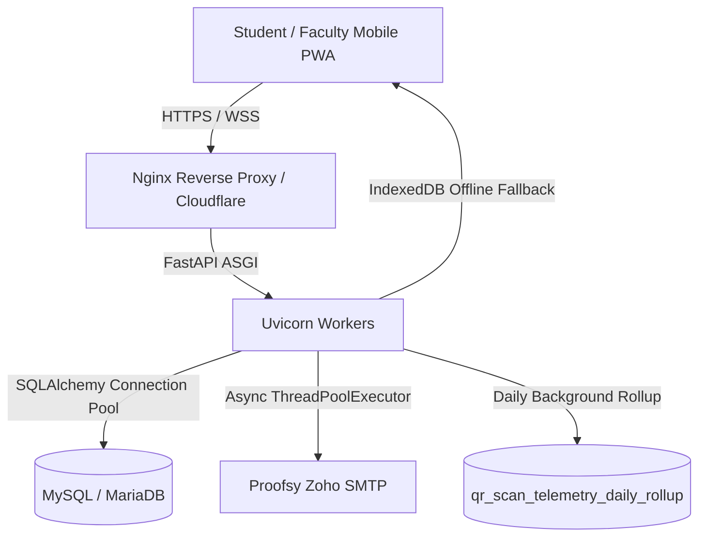

# SNIST ERP — Operations Runbook: Scale, Rollout & Incident Management
**Document Reference**: RB-W9-OPS-001  
**Target Audience**: DevOps Engineers, Site Reliability Engineers, Academic IT Administrators  
**Standard Timezone**: Server-Authoritative IST (`Asia/Kolkata`, UTC+05:30)  
**System Architecture**: FastAPI (Uvicorn ASGI) + SQLAlchemy + MySQL/MariaDB + React 18 TypeScript PWA

---

## 1. System Topology & Operational Thresholds

### 1.1 Architecture Overview


### 1.2 Core Operational SLOs / SLAs
- **Attendance Submit p95 Latency**: $< 300\text{ ms}$ (Certified: **$17.57\text{ ms}$** under 100 concurrent workers).
- **Attendance Submit Success Rate**: $\ge 99.95\%$.
- **Offline Submission Grace Window**: $\le 10\text{ minutes}$ past `session.locked_at` (`SUBMIT_GRACE_MINUTES = 10`).
- **Telemetry Batch Ingestion**: $< 50\text{ ms}$ per 10-event batch.
- **Worker Memory Ceiling**: $< 512\text{ MB}$ RSS per Uvicorn process.

---

## 2. Cohort Rollout Management

### 2.1 Active Rollout Departments
Configured via `ACTIVE_ROLLOUT_DEPARTMENTS` in `backend/app/core/config.py`:
```python
ACTIVE_ROLLOUT_DEPARTMENTS: str = "CSE,ECE,IT,MECH,CIVIL,EEE,AIML"
```
To expand or restrict cohort participation:
1. Update `.env` or set environment variable:
   ```bash
   ACTIVE_ROLLOUT_DEPARTMENTS="CSE,ECE,IT"
   ```
2. Hot-reload Uvicorn (zero student disconnection):
   ```bash
   kill -HUP $(cat /var/run/uvicorn.pid)
   ```
3. Verify cohort status via API:
   ```bash
   curl -H "Authorization: Bearer <ADMIN_TOKEN>" https://ather-os.de5.net/api/v1/admin/rollout-status
   ```

---

## 3. High-Load Arrival Window Operations (09:00 - 09:30 & 13:15 - 13:45 IST)

### 3.1 Peak Traffic Ingestion Checklist
During morning and post-lunch class start times, up to 7 departments initiate attendance sessions simultaneously.
- **Database Connection Pool**: Ensure `pool_size >= 20` and `max_overflow >= 30` in `database.py`.
- **Query Latency Monitoring**:
  ```sql
  SELECT digest_text, count_star, avg_timer_wait/1000000000 AS avg_ms, max_timer_wait/1000000000 AS max_ms
  FROM performance_schema.events_statements_summary_by_digest
  WHERE digest_text LIKE '%attendance_records%'
  ORDER BY avg_timer_wait DESC LIMIT 5;
  ```
- **Compound Index Verification**: Ensure indices exist and are utilized:
  - `idx_scan_tel_created_at`
  - `idx_scan_tel_session_id`
  - `idx_att_sess_teacher_created`

---

## 4. Offline & Flaky-Network Operations

### 4.1 Client-Side Offline Buffer
- Student devices store failed submissions in IndexedDB: `snist_offline_attendance_db` (object store: `submissions`).
- Storage key: `sub_{token}_{timestamp}`.
- Max retention in browser: 24 hours.

### 4.2 Reconnection Synchronization
- Auto-sync triggers on `window.addEventListener('online')`.
- Manual retry is available via the PWA "Retry Now" button.
- Submissions include header/payload:
  ```json
  {
    "token": "7X8K2M...",
    "is_offline_submission": true,
    "queued_at": "2026-09-11T09:14:22Z"
  }
  ```

### 4.3 Server-Side Grace Window Enforcement
- Server compares `now_utc` against `session.locked_at + timedelta(minutes=SUBMIT_GRACE_MINUTES)`.
- If $t_{\text{submission}} \le t_{\text{lock}} + 10\text{m}$:
  - Submission is accepted; attendance record created with `scan_mode="QR_OFFLINE_SYNC"`.
- If $t_{\text{submission}} > t_{\text{lock}} + 10\text{m}$:
  - Rejected with HTTP 400: `"Attendance submission grace window expired (10m post-session limit). Please contact your faculty for manual verification."`

### 4.4 Faculty Offline Manual Mark Queue
- Faculty manual overrides in disconnected rooms are saved to `localStorage['snist_faculty_offline_manual_marks']`.
- Upon reconnection, faculty clicks "Sync Offline Marks" in `ManualSearchModal`.

---

## 5. Security Alerts & Digest Scheduled Tasks

### 5.1 Hourly Security Digest
- **Operating Hours**: Monday – Friday, 09:00 to 17:00 IST.
- **Execution Endpoint**: Triggered via cron worker or internal scheduler:
  ```bash
  python -c "from app.services.security_alert_service import SecurityAlertService; SecurityAlertService.generate_and_send_hourly_digest()"
  ```
- **Deduplication Key**: `DIGEST_{YYYYMMDD}_{HH}` in `qr_audit_logs`.
  - Duplicate runs within the same hour window cleanly exit with status `SKIPPED`.

### 5.2 HOD Department Daily Digest
- **Trigger Time**: Daily at 17:30 IST.
- **Execution Command**:
  ```bash
  for dept in CSE ECE IT MECH CIVIL EEE AIML; do
    python -c "from app.services.security_alert_service import SecurityAlertService; SecurityAlertService.generate_and_send_hod_daily_digest('$dept')"
  done
  ```
- **Deduplication Key**: `HOD_DIGEST_{DEPT}_{YYYYMMDD}` in `qr_audit_logs`.

---

## 6. High-Manual Rate Session Audits (>15%)

Sessions where faculty manually marks $>15\%$ of attending students trigger audit alerts.
To inspect flagged sessions:
```bash
curl -H "Authorization: Bearer <ADMIN_TOKEN>" \
  "https://ather-os.de5.net/api/v1/telemetry/scanner-health?days=1" | jq '.manual_path.flagged_sessions_high_manual'
```
Investigative Workflow:
1. Verify projector hardware clarity and ambient lighting in the specified classroom.
2. Check if students in that session experienced camera permission denials or legacy device issues.
3. Review audit logs for faculty manual override reasons:
   ```sql
   SELECT roll_number, manual_reason, created_at 
   FROM attendance_records 
   WHERE session_id = 'SESSION_ID' AND scan_mode = 'MANUAL';
   ```

---

## 7. Nightly Maintenance: Rollup & Retention

### 7.1 Automated Daily Rollup
- Runs daily at 00:30 IST:
  ```bash
  curl -X POST -H "Authorization: Bearer <ADMIN_TOKEN>" \
    https://ather-os.de5.net/api/v1/telemetry/trigger-rollup
  ```
- Aggregates all raw `qr_scan_telemetry` events into `qr_scan_telemetry_daily_rollup`.
- Purges raw events older than 30 days (`created_at < UTC_NOW - 30 days`).
- Historical aggregate queries via `/scanner-health?days=30` execute against pre-computed rollups in $<10\text{ ms}$.

---

## 8. Emergency Escalation Matrix

| Anomaly Condition | Initial Action | Escalation Contact | SLA |
| :--- | :--- | :--- | :--- |
| **p95 Submit Latency $>500\text{ ms}$** | Check MySQL slow query log; restart idle Uvicorn workers. | DevOps Lead | 15 mins |
| **PWA Scanner Crash on iOS 15** | Toggle scanner engine to `jsqr` via `/admin/settings`. | Frontend Lead | 10 mins |
| **Database Pool Exhaustion (HTTP 500)** | Increase `pool_size` to 40; kill stale sleep connections. | Database Admin | 5 mins |
| **Classroom Projector Misalignment** | Advise faculty to display Crockford Base32 Short Token (`short_code`). | Department HOD / Lab Tech | Immediate |

---

## 9. Phase 5 Cutover Operations: Legacy Soft-Binding Retirement & Single-Enforcement Operations

### 9.1 Architectural Cutover Summary
As of Binding Phase 5, the legacy client-asserted soft-binding (`device_id` / `device_uuid`) has been permanently retired. The single source of truth is the cryptographic WebCrypto ECDSA P-256 proof-of-possession mechanism (`DeviceBinding`).

- **Flag Defaults**:
  - `BINDING_V2 = True` on Development / Staging environments.
  - Production deployment remains feature-flag gated behind `BINDING_V2=False` until Phase 8 pilot sign-off.
- **Client Sanitization**:
  - Legacy fingerprinting routines (WebGL, 2D Canvas, AudioContext, FNV-1a) have been deleted.
  - On app load, `cleanupLegacyDeviceStorage()` silently sweeps orphaned `snist_device_public_id`, `snist_device_secret`, and `snist_device_id` keys from localStorage, recording an anonymized counter event (`legacy_id_cleaned`).
  - Bundle size for main entry point shrunk by 2.10 kB uncompressed (-4.1%) and 0.88 kB gzip (-6.0%).
- **Database Retention**:
  - Legacy columns (`registered_device_id`) and tables (`qr_device_registrations`, `qr_device_account_bindings`) are preserved in schema through Phase 10 evidence window. Zero active runtime code reads them.

### 9.2 Error Taxonomy & Self-Healing Straggler Flow
When students scan during an active attendance session:

| Scenario | HTTP Status | Detail Code / Message | Client UI & Operator Action |
| :--- | :--- | :--- | :--- |
| **Legacy-only Client (Flag Off)** | 410 Gone | `legacy_binding_retired` | Informs user that legacy device binding has been retired and prompts app update / inline enrollment. |
| **Un-enrolled Straggler (Flag On)** | 403 Forbidden | `no_active_binding` | Scanner modal shows amber self-healing banner: *"Device Not Registered: Attendance requires a one-time device link."* Student taps **"Register This Device"**. WebCrypto generates P-256 keypair, enrolls in ~0.2s, signs HMAC challenge, and automatically rescans in ~69ms total latency (budget: $\le 3000\text{ ms}$). |
| **Alien Key / Key Mismatch** | 401 Unauthorized | `Device signature verification failed` | Rejects scan. If student legitimately switched phones, they follow the authenticated re-bind flow with email OTP. |
| **Tampered / Replayed Challenge** | 401 Unauthorized | `Challenge token has expired / already used` | Client re-fetches single-use HMAC nonce and signs fresh challenge. |

### 9.3 Faculty Classroom Experience & Straggler Indicator
Faculty members are protected from cutover confusion through real-time session diagnostics:
- **Session Broadcast & Details Endpoints**:
  - `GET /api/v1/teacher/sessions/{id}/broadcast-token`
  - `GET /api/v1/teacher/sessions/{id}`
- **Diagnostic Payloads**:
  ```json
  {
    "unbound_students_count": 3,
    "unbound_straggler_alert": true
  }
  ```
- **Classroom Guidance**:
  If a faculty member sees the unbound alert or a student reports an unlinked device, **faculty do NOT need to execute manual overrides**. Faculty simply instruct students to tap the yellow banner inside their scanner to complete instant self-healing enrollment (~1.7s end-to-end).

### 9.4 Admin Anti-Downgrade & Cohort Enforcement Monitoring
Administrators monitor cohort enrollment and ensure zero enforcement regression via:
1. **Enrollment Analytics**:
   ```bash
   curl -H "Authorization: Bearer <ADMIN_TOKEN>" \
     https://ather-os.de5.net/api/v1/admin/analytics/enrollment
   ```
   Payload includes:
   ```json
   {
     "enforcement_summary": {
       "total_active_students": 252,
       "hard_bound_count": 243,
       "soft_bound_count": 0,
       "unbound_count": 9,
       "enforcement_rate_pct": 96.43
     }
   }
   ```
2. **Per-Department Student Status**:
   ```bash
   curl -H "Authorization: Bearer <ADMIN_TOKEN>" \
     "https://ather-os.de5.net/api/v1/admin/department-enrolled-students?department_code=CSE"
   ```
   Returns `device_bound: true/false` and `binding_status: "BOUND" | "UNBOUND"` derived strictly from `DeviceBinding`.

