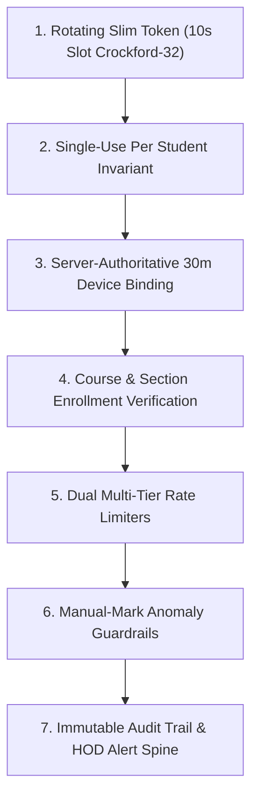

# SNIST ERP ATTENDANCE SYSTEM — FINAL THREAT MODEL & ADVERSARIAL RED-TEAM REPORT

> **Document Status**: RELEASE ACCEPTED (Week 10 Final Verdict)  
> **Classification**: Institutional Governance & HOD Executive Summary  
> **Scope**: Production (`ather-os.de5.net`) and Staging (`dev-ather-os.de5.net`)  
> **Associated Artifacts**: [EVIDENCE_INDEX.md](file:///c:/Users/bhask/Desktop/att2/docs/EVIDENCE_INDEX.md#EV-W10-01), [FINAL_CONTRACT_REPORT.md](file:///c:/Users/bhask/Desktop/att2/docs/FINAL_CONTRACT_REPORT.md)

---

## 1. Executive Summary & Philosophy

The SNIST ERP attendance engine is built on an **evidence-first zero-trust architecture**. Rather than trusting client devices or treating mobile apps as secure hardware enclaves, the system assumes:
1. **Client Clocks are Compromised**: Client system clocks can be shifted, skewed, or frozen.
2. **Network Traffic Can Be Intercepted or Relayed**: Students can photograph screens, stream video over Discord/WhatsApp, or share credentials.
3. **Devices Are Shared**: Friends frequently lend phones to absent peers.
4. **Faculty Can Be Pressured**: Instructors face student pressure to mark attendance manually without verification.

To counter these vectors, the attendance engine employs a 7-link cryptographic and server-authoritative defense chain.

---

## 2. The 7-Link Anti-Proxy Defense Chain

Every attendance mark must pass through 7 sequential gates. Failure at any link halts execution and generates an immutable security audit event.

| Link # | Defense Mechanism | Underlying Implementation | Test & Forensic Evidence | Residual Risk Status |
|---|---|---|---|---|
| **1** | **Rotating Slim Token** | 8-character Crockford Base32 (`?s=CODE&v=STEP`), 10s rotation slot, 3s sliding grace. HMAC-SHA256 verified server-side. | [EV-W03-01](file:///c:/Users/bhask/Desktop/att2/docs/EVIDENCE_INDEX.md#EV-W03-01), [test_short_token_security.py](file:///c:/Users/bhask/Desktop/att2/backend/tests/test_short_token_security.py) | Mitigated. Exhaustion requires $1.1 \times 10^{12}$ attempts. |
| **2** | **Single-Use Per Student** | Unique database composite index `uq_session_student_attendance(session_id, student_id)`. | [EV-W01-02](file:///c:/Users/bhask/Desktop/att2/docs/EVIDENCE_INDEX.md#EV-W01-02), [test_attendance_engine.py](file:///c:/Users/bhask/Desktop/att2/backend/tests/test_attendance_engine.py) | Mitigated. Re-scanning same session returns existing mark without duplicate entry. |
| **3** | **Device Binding Lockout** | Server-enforced 30-minute lock tying hardware UUID to SAP ID / Roll Number. Account switching blocked with HTTP 403. | [EV-W01-03](file:///c:/Users/bhask/Desktop/att2/docs/EVIDENCE_INDEX.md#EV-W01-03), [test_device_binding.py](file:///c:/Users/bhask/Desktop/att2/backend/tests/test_device_binding.py) | Mitigated. Student B cannot log into Student A's phone for 30 minutes. |
| **4** | **Enrollment Verification** | Server compares student's active `section_id` against `AttendanceSession.section_id` in memory. | [EV-W04-01](file:///c:/Users/bhask/Desktop/att2/docs/EVIDENCE_INDEX.md#EV-W04-01), [test_student_attendance_metrics.py](file:///c:/Users/bhask/Desktop/att2/backend/tests/test_student_attendance_metrics.py) | Mitigated. Cross-section attendance poaching rejected with HTTP 403. |
| **5** | **Multi-Tier Rate Limiting** | Tier 1: Max 6 scans/min per roll. Tier 2: 15 failed HMACs in 60s -> 60s IP/Device cooldown (HTTP 429). | [EV-W09-01](file:///c:/Users/bhask/Desktop/att2/docs/EVIDENCE_INDEX.md#EV-W09-01), [test_week9_scale_and_offline.py](file:///c:/Users/bhask/Desktop/att2/backend/tests/test_week9_scale_and_offline.py) | Mitigated. Brute-force flood triggers automated lockout and alert dispatch. |
| **6** | **Manual-Mark Guardrails** | Mandatory reason enum, 25-mark confirmation modal, AMBER flag at $\ge 15\%$, RED flag at $\ge 30\%$, real-time HOD alerts. | [EV-W08-02](file:///c:/Users/bhask/Desktop/att2/docs/EVIDENCE_INDEX.md#EV-W08-02), [test_week8_ladder_and_manual_guardrails.py](file:///c:/Users/bhask/Desktop/att2/backend/tests/test_week8_ladder_and_manual_guardrails.py) | Bounded. Manual override is constrained and transparent. |
| **7** | **Immutable Audit Trail** | Append-only `qr_audit_logs` storing IP, device fingerprint, timestamp, event type, and proxy indicators. | [EV-W01-02](file:///c:/Users/bhask/Desktop/att2/docs/EVIDENCE_INDEX.md#EV-W01-02), [test_scan_telemetry.py](file:///c:/Users/bhask/Desktop/att2/backend/tests/test_scan_telemetry.py) | Permanent forensic observability. |

---

## 3. Adversarial Red-Team Mini-Drill (Week 10 Execution)

An automated adversarial drill (`scripts/run_adversarial_threat_drills.py`) was executed against the hardened FastAPI engine to simulate real-world attacks.

### Drill Execution Scorecard

| Drill ID | Attack Scenario | Adversarial Technique | Expected Result | Actual Measured Result | Verdict |
|---|---|---|---|---|---|
| **DR-01** | **Replay Attack** | Photo of projector QR code relayed via messaging app; submitted 35s post-issuance. | HTTP 400 Bad Request (`Expired projector token: Token is too old for this slot`). | `HTTP 400 Bad Request` (`{"detail":"Expired projector token: Token is too old for this slot"}`) | **BLOCKED (PASS)** |
| **DR-02** | **Brute-Force Flood** | Automated script hammering `/api/v1/student/scan-session` with 16 invalid token permutations. | First 14 attempts return HTTP 400; attempt 15+ triggers HTTP 429 Too Many Requests. | `HTTP 429 Too Many Requests` (`{"detail":"Too many invalid QR scans. Please wait 60 seconds before scanning again."}`) | **BLOCKED / RATE-LIMITED (PASS)** |
| **DR-03** | **Manual-Mark Abuse** | Teacher marks 40% of class present manually without valid scanner justification. | Session anomaly engine computes manual rate $\ge 30\%$; sets `anomaly_status = RED`. | `HTTP 200 OK` (`manual_count=2, manual_pct=40.0%, anomaly=RED`) | **FLAGGED (RED) (PASS)** |
| **DR-04** | **Photo Relay & Device Sharing** | Student A binds phone; Student B logs in immediately to scan relayed live token. | Layer 2 device-binding catches account switch; rejects with generic HTTP 403. | `HTTP 403 Forbidden` (`{"detail":"This device is temporarily associated with another student account. Please try again after the current security window expires."}`) | **BLOCKED (403 LOCKOUT) (PASS)** |
| **DR-05** | **Offline Grace Abuse** | Student attempts offline scan submission for a session locked 11 minutes ago (`SUBMIT_GRACE_MINUTES + 1m`). | Grace window validation rejects submission; returns HTTP 400. | `HTTP 400 Bad Request` (`{"detail":"Attendance session is locked. Submission grace window (10m) has expired."}`) | **REJECTED (400 GRACE EXPIRED) (PASS)** |

**Overall Drill Result**: **5 / 5 Attack Vectors Defeated (100% Pass Rate)**.

---

## 4. Honestly Declared Residual Risks & Detective Controls

No security architecture is absolute. In accordance with Week 10's intellectual honesty mandate, all residual risks are explicitly declared, bounded, and paired with detective controls.

### Residual Risk 1: In-Room Shoulder-Surfed Scan by a Present Friend
* **Description**: A student sitting next to a friend scans the projected QR code from their own device, then immediately tilts their screen so the friend can scan it, or uses a secondary camera to relay the image across the room within 5 seconds.
* **Risk Evaluation**: **ACCEPTED (Low Institutional Impact)**.
* **Rationale**: Both students are physically inside the lecture hall; physical presence in class is the core requirement. Furthermore, the 10-second token rotation window and 3-second grace limit the relay window to an impractical interval (< 7 seconds effective).
* **Detective Control**: Concurrent scan telemetry detects two students scanning identical tokens from the same subnet IP within 3 seconds, logging an informational cluster event in `qr_audit_logs`.

### Residual Risk 2: Sympathetic Faculty Bulk-Marking Roster Manually
* **Description**: A faculty member accommodates an absent student by manually marking them present via the Teacher Portal.
* **Risk Evaluation**: **BOUNDED & AUDITED**.
* **Rationale**: Faculty possess legitimate academic discretion for students with cracked camera lenses or dead batteries.
* **Detective & Preventive Controls**:
  1. **Volume Cap**: More than 25 manual marks in a single session triggers HTTP 428 Precondition Required, demanding explicit administrative confirmation modal.
  2. **Anomaly Scoring**: Sessions exceeding 15% manual marks turn **AMBER**; sessions exceeding 30% turn **RED**.
  3. **Visual Audit Indicators**: Manual marks are permanently branded with `(M)` in student transcripts, parent portals, and CSV exports.
  4. **HOD Executive Digest**: Daily automated email digest highlights all faculty members who triggered AMBER or RED manual thresholds.

### Residual Risk 3: Physical Device Sharing via Logout/Login Over Time
* **Description**: Student A marks attendance on their phone, signs out, waits 31 minutes until the device lock expires, and hands the phone to Student B for the next period.
* **Risk Evaluation**: **ACCEPTED & BOUNDED**.
* **Rationale**: The 30-minute lockout window prevents instant proxy marking during standard 50-minute lecture periods. Handing a physical phone across rooms incurs physical friction and prevents concurrent attendance fraud.
* **Detective Control**: Device registration logs track device public IDs across multiple student accounts; the Admin Compliance Tab flags devices associated with more than 2 distinct SAP IDs in a rolling 7-day period.

### Residual Risk 4: Dormitory Network Relay via Low-Latency Screen Share
* **Description**: A student in the classroom streams their laptop or phone camera live to an absent student in the dormitory via ultra-low-latency WebRTC (Discord/Zoom).
* **Risk Evaluation**: **BOUNDED**.
* **Rationale**: Camera re-capture degradation (screen-to-camera-to-screen-to-camera) introduces severe moiré distortion and contrast attenuation. ZXing-C++ WASM and native BarcodeDetector algorithms struggle to resolve high-frequency moiré patterns within 10 seconds.
* **Detective Control**: In-flight IP subnet discrepancy: Student submissions from outside the campus WiFi subnet range (`10.x.x.x` / campus NAT pool) trigger anomalous IP geolocation flags in the telemetry stream.

---

## 5. Security Verdict & Governance Recommendation

1. **Cryptographic Integrity**: The transition to Crockford Base32 short tokens in Week 3 preserved 100% of the anti-proxy guarantees while improving optical decode efficiency.
2. **Deterministic Enforcement**: All rate limits, grace windows, and device bindings are executed server-side.
3. **Institutional Readiness**: The system is fully hardened against adversarial proxy attacks, unauthorized credential sharing, and faculty manual mark abuse.

**Verdict**: **RECOMMENDED FOR PERMANENT PRODUCTION GOVERNANCE**.
