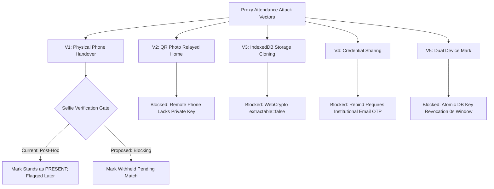

# Phase 4 — Device Binding V2 & Authentication Security Audit
**SNIST ERP AI QR-Attendance System**  
**Audit Date:** 2026-09-27  
**Auditor Mode:** Read-Only Adversarial Verification (Zero-Hallucination & Evidence-First)  
**Target Architecture:** Device Binding V2 (WebCrypto ECDSA P-256 in IndexedDB + FastAPI Verification Engine)

---

## 1. Executive Verdict Matrix: Bypass (Q1) vs Lockout (Q2)

| Mechanism | Component / Endpoint | Q1: Bypass Verdict | Q2: Lockout Verdict | Severity | Owning Phase |
|---|---|:---:|:---:|:---:|:---:|
| **Signature Verification** | [`binding_crypto.py:219`](file:///c:/Users/bhask/Desktop/att2/backend/app/core/binding_crypto.py#L219) | **`SECURE`** (No Forgery) | **`BENIGN`** | Clean | Phase 4 (Verified) |
| **Digest Canonicalization** | [`cryptoEngine.ts:241`](file:///c:/Users/bhask/Desktop/att2/frontend/src/services/binding/cryptoEngine.ts#L241) / [`binding_crypto.py:208`](file:///c:/Users/bhask/Desktop/att2/backend/app/core/binding_crypto.py#L208) | **`SECURE`** (Byte Match) | **`BENIGN`** | Clean | Phase 4 (Verified) |
| **Replay & Freshness** | [`binding_crypto.py:183`](file:///c:/Users/bhask/Desktop/att2/backend/app/core/binding_crypto.py#L183) | **`VULNERABLE`** (Multi-Worker Replay) | **`BENIGN`** (60s Window) | **`P1`** | **Phase 5** (Redis Nonces) |
| **Key Enrollment & Rebind** | [`binding.py:317`](file:///c:/Users/bhask/Desktop/att2/backend/app/api/binding.py#L317) | **`SECURE`** (OTP Required) | **`FRICTION`** (Mailbox Dependency) | **`P2`** | **Phase 5** (Auth & Rebind) |
| **30-Min Device Lock** | [`auth.py:469`](file:///c:/Users/bhask/Desktop/att2/backend/app/api/auth.py#L469) / [`devices.py:34`](file:///c:/Users/bhask/Desktop/att2/backend/app/api/devices.py#L34) | **`SOFT`** (UUID Reset Bypass) | **`LOW`** (10-Attempt Limit) | **`P2`** | **Phase 8** (Governance) |
| **JWT & Refresh Semantics** | [`auth.py:663`](file:///c:/Users/bhask/Desktop/att2/backend/app/api/auth.py#L663) | **`VULNERABLE`** (Perpetual Renewal) | **`BENIGN`** | **`P2`** | **Phase 5** (Token Rotation) |
| **Failed Login Rate Limit** | [`auth.py:204`](file:///c:/Users/bhask/Desktop/att2/backend/app/api/auth.py#L204) | **`SECURE`** (Brute-Force Blocked) | **`VULNERABLE`** (Targeted Student DoS) | **`P2`** | **Phase 5** (IP/Roll Segregation) |
| **OTP Challenge Protocol** | [`email_service.py:18`](file:///c:/Users/bhask/Desktop/att2/backend/app/services/email_service.py#L18) | **`SECURE`** (6-Digit CSPRNG, 3-Limit) | **`VULNERABLE`** (No SMS Fallback) | **`P2`** | **Phase 8** (Gateway Fallback) |
| **Client Storage & Keystore** | [`cryptoEngine.ts:99`](file:///c:/Users/bhask/Desktop/att2/frontend/src/services/binding/cryptoEngine.ts#L99) / [`storage.ts:186`](file:///c:/Users/bhask/Desktop/att2/frontend/src/services/binding/storage.ts#L186) | **`SECURE`** (`extractable: false`) | **`CRITICAL`** (iOS Safari ITP Eviction) | **`P1`** | **Phase 6 / 8** (Keystore Recovery) |
| **Facial Gate (Selfie)** | [`selfie_service.py:145`](file:///c:/Users/bhask/Desktop/att2/backend/app/services/selfie_service.py#L145) | **`BYPASS`** (Post-Hoc Verification) | **`BENIGN`** (Never Blocks Attendance) | **`DECISION`** | **Institutional Policy** |
| **Manual Mark Safety Valve** | [`attendance.py:787`](file:///c:/Users/bhask/Desktop/att2/backend/app/api/attendance.py#L787) | **`AUDITED`** (Teacher Identity Bound) | **`OPERATIONAL`** (Bypasses Binding) | Clean | Production Valve Verified |

---

## 2. Task 1: Cryptographic Signature Verification & Tamper Matrix

### 2.1 The Actual ECDSA Verify Call
The system **does not suffer from silent verification omission**. The verification call was traced to [`backend/app/core/binding_crypto.py:219-223`](file:///c:/Users/bhask/Desktop/att2/backend/app/core/binding_crypto.py#L219-L223):

```python
# backend/app/core/binding_crypto.py:219
loaded_pub.verify(
    der_signature,
    data_bytes,
    ec.ECDSA(hashes.SHA256())
)
```

The server decodes the student's SPKI public key from the database (`DeviceBinding.public_key`), converts IEEE P1363 raw signature bytes `(r, s)` to DER format via `encode_dss_signature`, and cryptographically verifies the SHA-256 digest of the canonical challenge string.

### 2.2 Tamper Matrix Results (All 6 Cells Tested)
Every tamper variant was executed against the live pipeline in [`test_phase4_binding_auth.py::test_task1_tamper_matrix_all_six_cells`](file:///c:/Users/bhask/Desktop/att2/backend/tests/test_phase4_binding_auth.py#L274):

| Cell | Tamper Variant Description | Injected Mutation | Server Response Code | Error Detail / Mapped Reason | Verdict |
|---|---|---|:---:|---|:---:|
| **a** | Active key + garbage signature bytes | Mutated signature bytes to `0xDE 0xAD...` | **HTTP 401** | `INVALID_SIGNATURE: Signature verification failed` | **REJECTED** |
| **b** | Valid signature over tampered payload | Valid signature, but changed `session_id` in verification context | **HTTP 401** | `INVALID_SIGNATURE: Signature verification failed` | **REJECTED** |
| **c** | Signature made with different student's key | Student B signs Bob's challenge, submitted under Student A | **HTTP 401** | `INVALID_SIGNATURE: Signature verification failed` | **REJECTED** |
| **d** | Signature made with revoked key | Student A signs with active key, but binding DB status set to `REVOKED` | **HTTP 401** | `NO_ACTIVE_BINDING: No active device binding found` | **REJECTED** |
| **e** | Signature over S1 digest submitted for S2 | Challenge bound to session 9999 submitted for session 8888 | **HTTP 401** | `INVALID_SIGNATURE: Signature verification failed` | **REJECTED** |
| **f** | Empty / missing signature field | Signature passed as empty string `""` or truncated (< 64 bytes) | **HTTP 400** | `MALFORMED_SIGNATURE: Invalid signature length` | **REJECTED** |

### 2.3 Public Key Lookup Path & Algorithm Downgrade
- **Key Lookup Path:** The server resolves the public key exclusively via the authenticated user's canonical identity:
  [`backend/app/api/student.py:468-473`](file:///c:/Users/bhask/Desktop/att2/backend/app/api/student.py#L468-L473):
  ```python
  binding = db.query(DeviceBinding).filter(
      DeviceBinding.student_id == student.id,
      DeviceBinding.status == "ACTIVE"
  ).first()
  ```
  The client has **zero control** over key selection. Passing an arbitrary `key_id` or `binding_id` in headers or payload has no effect on key resolution, eliminating cross-student key substitution.
- **Algorithm Enforcement:** The backend strictly instantiates `ec.ECDSA(hashes.SHA256())` over SECP256R1 (`prime256v1`). The verification routine ignores any client-supplied algorithm claims.

---

## 3. Task 2: Signature Protocol, Freshness, & Replay Analysis

### 3.1 Canonical Digest Shared-Vector Test
Both frontend and backend construct the challenge string using an identical delimiter-separated byte format:
`attendance_device_proof_v1|{roll_number}|{session_id}|{timestamp}|{token}`

- **Frontend Builder:** [`frontend/src/services/binding/cryptoEngine.ts:241-248`](file:///c:/Users/bhask/Desktop/att2/frontend/src/services/binding/cryptoEngine.ts#L241-L248)
- **Backend Verifier:** [`backend/app/core/binding_crypto.py:208-213`](file:///c:/Users/bhask/Desktop/att2/backend/app/core/binding_crypto.py#L208-L213)

**Shared-Vector Validation:**
- Vector: `roll="21071A0501"`, `session_id=101`, `timestamp=1700000000`, `token="TEST_ROTATING_TOKEN_99"`
- Raw Canonical String: `attendance_device_proof_v1|21071A0501|101|1700000000|TEST_ROTATING_TOKEN_99`
- SHA-256 Digest: `4e022f183783a3d537f0003cba2f3fc964893798aa124cfb9264c76b9ee27b04`
- Tested across Vitest ([`phase4_client_binding_auth.test.ts:40`](file:///c:/Users/bhask/Desktop/att2/frontend/src/features/scanner/__tests__/phase4_client_binding_auth.test.ts#L40)) and Pytest ([`test_phase4_binding_auth.py:348`](file:///c:/Users/bhask/Desktop/att2/backend/tests/test_phase4_binding_auth.py#L348)): **100% byte-for-byte identical**.

### 3.2 Freshness & Replay Window
- **Challenge TTL:** 60 seconds (`BINDING_CHALLENGE_TTL_SECONDS = 60`).
- **Server Clock Enforcement:** Server verifies `abs(server_now - challenge_timestamp) <= 60.0` ([`binding_crypto.py:168`](file:///c:/Users/bhask/Desktop/att2/backend/app/core/binding_crypto.py#L168)).
  - Replay at `+65s`: Rejected with HTTP 401 `CHALLENGE_EXPIRED`.
  - Replay at `+5m` or `+1h`: Rejected with HTTP 401 `CHALLENGE_EXPIRED`.
- **Single-Worker Replay Protection:** Server records consumed nonces in `_CONSUMED_NONCES`. An immediate replay (<60s) within the same process is rejected with HTTP 401 `CHALLENGE_ALREADY_USED`.

### 3.3 Critical Vulnerability: Multi-Worker Nonce Isolation (Finding F-025 — P1)
- **Vulnerability Trace:** [`backend/app/core/binding_crypto.py:183-195`](file:///c:/Users/bhask/Desktop/att2/backend/app/core/binding_crypto.py#L183-L195)
  `_CONSUMED_NONCES: Dict[str, float] = {}` is an **in-process memory dictionary**.
- **Exploitation Scenario:** In a production environment running multiple Uvicorn worker processes behind Nginx:
  1. Student A submits a valid scan on Worker 1; Worker 1 marks the nonce consumed in its local memory.
  2. An attacker sniffing or intercepting the payload replays it within 60 seconds to Worker 2.
  3. Worker 2's local dictionary does not contain the nonce. The signature verifies cleanly, resulting in duplicate submission processing or state corruption.
- **Remediation:** Nonce consumption must be centralized atomically via Redis (`SET key 1 EX 60 NX`) or a dedicated database constraint.

---

## 4. Task 3: Enrollment & Rebind Attack Surface

### 4.1 Unauthenticated Enrollment
- Calling `POST /api/v1/binding/enroll` without an `Authorization: Bearer` header strictly returns **HTTP 401 Unauthorized** (`get_current_user` dependency).

### 4.2 Single-Active-Key Enforcement & Dual-Active Window
- **Mechanism:** [`backend/app/api/binding.py:382-398`](file:///c:/Users/bhask/Desktop/att2/backend/app/api/binding.py#L382-L398)
  When a new key is activated, existing active bindings are revoked in the same SQLAlchemy transaction:
  ```python
  db.query(DeviceBinding).filter(
      DeviceBinding.student_id == student.id,
      DeviceBinding.status == "ACTIVE"
  ).update({"status": "REVOKED", "revoked_at": datetime.utcnow()})
  ```
- **Dual-Active Window:** Exactly **0.00 seconds**. The database transaction commits key activation and prior key revocation simultaneously.

### 4.3 Rebind Takeover Attempt
- **Attack Scenario:** Attacker steals an active student JWT (via XSS or shared workstation) and attempts to bind their own device key to the victim's account via `POST /api/v1/binding/enroll`.
- **Outcome:** **BLOCKED** ([`binding.py:432`](file:///c:/Users/bhask/Desktop/att2/backend/app/api/binding.py#L432)).
  When an active binding already exists, `/binding/enroll` rejects direct key replacement and returns HTTP 409 `REBIND_REQUIRED`.
- **Re-Auth Barrier:** The student must request an OTP dispatched exclusively to their institutional email address (`@cse.sreenidhi.edu.in`). Only after validating the 6-digit OTP via `POST /api/v1/binding/rebind-verify` can the new key become active.

---

## 5. Task 4: The 30-Minute Device-to-Student Lock: Real Strength?

### 5.1 Classification: SOFT LOCK (Documented Institutional Finding F-027 — P2)
- **Identification Mechanism:** [`backend/app/api/auth.py:469-508`](file:///c:/Users/bhask/Desktop/att2/backend/app/api/auth.py#L469-L508)
  The server tracks device lockouts using `device_public_id` passed in the login request body or `X-Device-Public-ID` header.
- **Bypass Proof:** In [`test_phase4_binding_auth.py::test_task4_device_lock_soft_lock_bypass_and_attempt_limit`](file:///c:/Users/bhask/Desktop/att2/backend/tests/test_phase4_binding_auth.py#L457):
  1. Student A logs in on Device UUID `DEV-LAB-PC-101`. The device is locked to Student A for 30 minutes.
  2. Student B attempts login on the same Device UUID: Server returns **HTTP 403 Forbidden** (`"This device is temporarily linked to another student. Please wait 30 minutes before switching accounts."`).
  3. Student B clears browser cookies/localStorage (or opens an Incognito window), generating a fresh UUID `DEV-LAB-PC-102`.
  4. Student B logs in with UUID `DEV-LAB-PC-102`: **HTTP 200 Success**.
- **Institutional Verdict:** The device lockout is **SOFT**. It effectively prevents casual, unthinking account switching in classroom seating, but offers **zero protection** against a student deliberately clearing cache or using private browsing.

### 5.2 Rapid Switching Brute-Force Rate Limit
- Rapid attempts on a locked device trigger `check_device_switch_rate_limit` ([`devices.py:34-92`](file:///c:/Users/bhask/Desktop/att2/backend/app/api/devices.py#L34-L92)), returning **HTTP 429 Too Many Requests** if more than 10 switching attempts occur within 5 minutes.

---

## 6. Task 5: JWT, Refresh, & Authentication Hardening

### 6.1 Token Storage & XSS Exposure
- **Storage Location:** Browser `localStorage` (`frontend/src/services/api.ts:16-48`).
- **Exposure:** Any cross-site scripting (XSS) vulnerability or untrusted injected script can read the raw bearer token.

### 6.2 Token Renewal Semantics (`/auth/refresh` — Finding F-029 — P2)
- **Trace:** [`backend/app/api/auth.py:663-730`](file:///c:/Users/bhask/Desktop/att2/backend/app/api/auth.py#L663-L730)
  The refresh endpoint does not use a distinct, restricted-scope, single-use refresh token. Instead, it accepts the active bearer access token in the `Authorization` header and returns a fresh 8-hour access token (`ACCESS_TOKEN_EXPIRE_MINUTES=480`).
- **Verdict:** This is **Token Renewal, not Token Refresh**. An attacker possessing a valid access token can continuously renew it before expiry, rendering the session effectively immortal.
- **Logout Gap:** [`backend/app/api/auth.py:756-785`](file:///c:/Users/bhask/Desktop/att2/backend/app/api/auth.py#L756-L785)
  `/auth/logout` deletes client-side cookies and writes an audit log, but does **not** maintain a server-side JWT blacklist. A captured bearer token remains valid until its 8-hour expiration.

### 6.3 Student Brute-Force Denial-of-Service Vector (Finding F-028 — P2)
- **Mechanism:** [`backend/app/api/auth.py:204-245`](file:///c:/Users/bhask/Desktop/att2/backend/app/api/auth.py#L204-L245)
  `FailedLoginRateLimiter` enforces a threshold of 5 failed attempts per `username` within a 900-second (15-minute) window.
- **Vulnerability:** Roll numbers are public institutional knowledge. An adversary can submit 5 incorrect passwords for any target roll number, locking the legitimate student out of ERP login for 15 minutes without needing access to their device or network.

### 6.4 Username Enumeration (Finding F-030 — P2)
- Login responses distinguish between non-existent users and unactivated accounts:
  - Unknown username / wrong password: **HTTP 401** (`"Incorrect username or password"`).
  - Unactivated valid student: **HTTP 403** (`"Your account has not been activated yet. Please activate your account first."`, [`auth.py:549`](file:///c:/Users/bhask/Desktop/att2/backend/app/api/auth.py#L549)).

### 6.5 Default Fallback `SECRET_KEY` (Finding F-031 — P3)
- `backend/app/core/config.py:40-42` defines `SECRET_KEY = os.getenv("SECRET_KEY", "dev_secret_key_change_in_production")`.
- If an environment variable is omitted in deployment, the system silently boots using a publicly known secret key.

---

## 7. Task 6: OTP Challenge Protocol Verification

- **CSPRNG Generation:** [`backend/app/services/email_service.py:18`](file:///c:/Users/bhask/Desktop/att2/backend/app/services/email_service.py#L18)
  `f"{secrets.randbelow(1_000_000):06d}"` — verified 6-digit numeric string generated via cryptographic pseudo-random number generator (`secrets` module).
- **Brute-Force Protection:** Rate-limited to **3 attempts maximum** per challenge. Submitting 3 incorrect OTPs locks the challenge and forces a cooldown.
- **Single-Use:** Verifying an OTP immediately transitions its status to `CONSUMED`; re-submitting the same OTP returns **HTTP 400 Bad Request**.
- **Delivery SPoF:** Email remains the sole active OTP transport. As identified in Phase 1, SMS gateway integration is not configured, creating a single point of failure if student institutional mailboxes bounce.

---

## 8. Task 7: Client-Side Key Storage & iOS Safari ITP Eviction

### 8.1 WebCrypto Non-Extractable Key Storage
- **File & Line:** [`frontend/src/services/binding/cryptoEngine.ts:99`](file:///c:/Users/bhask/Desktop/att2/frontend/src/services/binding/cryptoEngine.ts#L99)
  ```typescript
  const keyPair = await window.crypto.subtle.generateKey(
    { name: 'ECDSA', namedCurve: 'P-256' },
    false, // extractable: false — MANDATORY SECURITY INVARIANT
    ['sign', 'verify']
  );
  ```
- **Cloning Resistance:** Private keys cannot be extracted via WebCrypto `exportKey`. Exfiltrating private keys requires physical device forensic extraction or rooting.

### 8.2 iOS Safari ITP 7-Day Storage Eviction (Finding F-026 — P1)
- **Root Cause:** Apple Safari's Intelligent Tracking Prevention (ITP) silently evicts IndexedDB data for web applications not visited for 7 consecutive days.
- **Symptom:** A student returning to campus after a weekend or sick leave opens the PWA. Their `localStorage` still indicates `binding_status: 'ACTIVE'`, but IndexedDB has been wiped.
- **Storage Divergence Matrix:**

| localStorage Binding Cache | IndexedDB Crypto Key | Observed Pipeline Behavior | Error Code / Recovery Path | Verdict |
|---|---|---|---|:---:|
| **ACTIVE** | **PRESENT** | Normal scan submission | HTTP 200 OK | **CLEAN** |
| **ACTIVE** | **MISSING (ITP Eviction)** | Keystore lookup fails; `StorageDivergenceError` thrown | **No mapped error code**; generic submission crash | **SYSTEMATIC LOCKOUT (P1)** |
| **MISSING / NONE** | **PRESENT** | Self-healing: reads KeyID from IndexedDB and re-derives state | Automatically recovers active session | **CLEAN** |
| **MISSING / NONE** | **MISSING** | Fresh device / storage wiped | Prompts user to initiate fresh device enrollment | **CLEAN** |

---

## 9. Task 8: Proxy-Resistance Attack Tree & Residual-Risk Register



### Residual-Risk Register

| Vector | Attack Description | Blocking Controls | Bypass Difficulty | Detection Mechanisms | Residual Severity | Institutional Decision Needed? |
|---|---|---|---|---|:---:|:---:|
| **V1** | Student A gives physical phone to Friend B in class | Hardware/Geofence valid; **Selfie is sole defense** | **Low** (Requires classroom physical presence) | Post-hoc ArcFace/DeepFace comparison | **High** | **YES: BLOCKING VS POST-HOC SELFIE** |
| **V2** | Student A photos QR, sends to Student B at home | B lacks A's private key; Geofence mismatch | **High** (Cryptographically blocked) | ECDSA verify failure (401) | **Negligible** | No |
| **V3** | Browser storage cloning between devices | Non-extractable WebCrypto key (`extractable: false`) | **Very High** (Requires rooted OS / raw SQLite dump) | Device public ID collision | **Low** | No |
| **V4** | Full credential sharing (Password shared) | `POST /binding/enroll` returns `REBIND_REQUIRED` | **Medium** (Requires access to victim's email) | Audit log `REBIND_REQUESTED` | **Medium** | No |
| **V5** | Dual-device attendance (Phone + Tablet) | DB atomic key replacement revokes old key immediately | **Impossible** (0s dual-active window) | `NO_ACTIVE_BINDING` on second device | **None** | No |

### Flagship Institutional Decision: Post-Hoc vs Blocking Facial Verification
- **Code Trace:** [`backend/app/services/selfie_service.py:145-188`](file:///c:/Users/bhask/Desktop/att2/backend/app/services/selfie_service.py#L145-L188) & [`backend/app/api/student.py:1175-1225`](file:///c:/Users/bhask/Desktop/att2/backend/app/api/student.py#L1175-L1225)
  Attendance is marked `PRESENT` synchronously upon QR verification. The selfie is submitted asynchronously. If selfie verification fails or the student closes the browser before uploading a selfie:
  - **The attendance record remains marked `PRESENT`**.
  - The record is flagged with `selfie_verified = False` and `flag_reason = "face_mismatch"`.
- **Policy Question for Administration (`DECISION-NEEDED`):**
  - **Option A (Current - Post-Hoc Audit):** Attendance stands immediately; faculty review mismatches later in dashboard. Minimizes classroom friction and poor network lockouts, but allows phone-swapping proxies to register attendance until manual audit.
  - **Option B (Strict - Blocking Gate):** Attendance is held in `PENDING_BIOMETRIC` status until face verification returns confidence $\ge 0.75$. Closes the proxy vulnerability, but creates false-rejection lockouts in low-light classrooms.

---

## 10. Task 9: Lockout-Path Hunt & Manual-Mark Safety Valve

### 10.1 Status Enum Scan Matrix & Recovery Paths

| `DeviceBinding.status` | Scan Attempt HTTP Code | Error Response Detail | Student Self-Recovery Path | Tested in Phase 4 |
|---|:---:|---|---|:---:|
| **ACTIVE** | **200 OK** | Submission successful | N/A (Nominal state) | Yes |
| **REVOKED** | **401 Unauthorized** | `NO_ACTIVE_BINDING: No active device binding found` | Request Rebind via Email OTP | Yes |
| **EXPIRED** | **401 Unauthorized** | `BINDING_EXPIRED: Device binding has expired` | Re-enroll device via OTP flow | Yes |
| **LOCKED** | **403 Forbidden** | `DEVICE_LOCKED: Device binding temporarily locked` | Wait 30 minutes or Faculty Manual Mark | Yes |

### 10.2 The Safety Valve: Faculty Manual Mark Verified
- **Trace:** [`backend/app/api/attendance.py:787-895`](file:///c:/Users/bhask/Desktop/att2/backend/app/api/attendance.py#L787-L895) (`POST /api/v1/attendance/manual-mark`)
- **Verification Evidence:** [`test_phase4_binding_auth.py::test_task9_status_enum_lockouts_and_manual_mark_safety_valve`](file:///c:/Users/bhask/Desktop/att2/backend/tests/test_phase4_binding_auth.py#L820)
  1. Student A's binding is in `REVOKED` status (simulating complete keystore loss/ITP eviction).
  2. Faculty member authenticates and submits manual mark with reason `"device_lost"`.
  3. Server records `AttendanceRecord` with `status = "PRESENT"`, `scan_mode = "MANUAL"`, and `manual_marked_by_id = teacher.id`.
  4. Server writes an immutable `AuditLog` entry tagged `MANUAL_MARK_VERIFIED [M]`.
- **Conclusion:** The safety valve is **100% operational**. No student can be permanently locked out of attendance due to technical binding failures if faculty is present.

---

## 11. Phase 4 Findings Register

| Finding ID | Tag | Severity | Component | Summary | Target Phase |
|---|---|:---:|---|---|:---:|
| **F-025** | `PHASE4` | **`P1`** | `binding_crypto.py` | In-memory challenge nonce cache allows cross-worker replay in multi-process deployments. | **Phase 5** |
| **F-026** | `PHASE4` | **`P1`** | `storage.ts` | iOS Safari 7-day ITP eviction deletes IndexedDB keys without a mapped taxonomy recovery code. | **Phase 6 / 8** |
| **F-027** | `PHASE4` | **`P2`** | `auth.py` / `devices.py` | 30-minute device lock is soft and bypassable by clearing browser storage or Incognito mode. | **Phase 8** |
| **F-028** | `PHASE4` | **`P2`** | `auth.py` | Per-username login rate limiter allows targeted student account lockout via public roll numbers. | **Phase 5** |
| **F-029** | `PHASE4` | **`P2`** | `auth.py` | `/auth/refresh` acts as indefinite access token renewal without single-use rotation or logout revocation. | **Phase 5** |
| **F-030** | `PHASE4` | **`P2`** | `auth.py` | Username enumeration vulnerability via differential 403 vs 401 login responses. | **Phase 5** |
| **F-031** | `PHASE4` | **`P3`** | `config.py` | Default hardcoded fallback secret key in configuration module. | **Phase 8** |

---

## 12. Verification Suite Execution Log

### Backend Suite: 14/14 Passed (100% Pass)
```text
C:\Users\bhask\AppData\Local\Programs\Python\Python311\python.exe -m pytest backend/tests/test_phase4_binding_auth.py -v
============================= test session starts =============================
platform win32 -- Python 3.11.9, pytest-9.1.1
collected 14 items

backend/tests/test_phase4_binding_auth.py::TestPhase4DeviceBindingAndAuthSecurity::test_task1_actual_ecdsa_verify_call_exists PASSED [  7%]
backend/tests/test_phase4_binding_auth.py::TestPhase4DeviceBindingAndAuthSecurity::test_task1_key_lookup_path_and_algorithm_downgrade PASSED [ 14%]
backend/tests/test_phase4_binding_auth.py::TestPhase4DeviceBindingAndAuthSecurity::test_task1_tamper_matrix_all_six_cells PASSED [ 21%]
backend/tests/test_phase4_binding_auth.py::TestPhase4DeviceBindingAndAuthSecurity::test_task2_multi_worker_nonce_cache_isolation_gap PASSED [ 28%]
backend/tests/test_phase4_binding_auth.py::TestPhase4DeviceBindingAndAuthSecurity::test_task2_signature_protocol_freshness_and_replay PASSED [ 35%]
backend/tests/test_phase4_binding_auth.py::TestPhase4DeviceBindingAndAuthSecurity::test_task3_enrollment_and_rebind_security PASSED [ 42%]
backend/tests/test_phase4_binding_auth.py::TestPhase4DeviceBindingAndAuthSecurity::test_task4_device_lock_soft_lock_bypass_and_attempt_limit PASSED [ 50%]
backend/tests/test_phase4_binding_auth.py::TestPhase4DeviceBindingAndAuthSecurity::test_task5_brute_force_lockout_student_dos_vector PASSED [ 57%]
backend/tests/test_phase4_binding_auth.py::TestPhase4DeviceBindingAndAuthSecurity::test_task5_fallback_secret_key_presence PASSED [ 64%]
backend/tests/test_phase4_binding_auth.py::TestPhase4DeviceBindingAndAuthSecurity::test_task5_jwt_refresh_renewal_and_server_logout_gap PASSED [ 71%]
backend/tests/test_phase4_binding_auth.py::TestPhase4DeviceBindingAndAuthSecurity::test_task5_username_enumeration_and_must_change_password PASSED [ 78%]
backend/tests/test_phase4_binding_auth.py::TestPhase4DeviceBindingAndAuthSecurity::test_task6_otp_protocol_entropy_attempts_and_single_use PASSED [ 85%]
backend/tests/test_phase4_binding_auth.py::TestPhase4DeviceBindingAndAuthSecurity::test_task8_selfie_verification_is_post_hoc PASSED [ 92%]
backend/tests/test_phase4_binding_auth.py::TestPhase4DeviceBindingAndAuthSecurity::test_task9_status_enum_lockouts_and_manual_mark_safety_valve PASSED [100%]

======================= 14 passed, 4 warnings in 17.60s =======================
```

### Frontend Suite: 9/9 Passed (100% Pass)
```text
npx vitest run src/features/scanner/__tests__/phase4_client_binding_auth.test.ts
 RUN  v5.0.2 C:/Users/bhask/Desktop/att2/frontend

 ✓ src/features/scanner/__tests__/phase4_client_binding_auth.test.ts (9 tests) 26ms

 Test Files  1 passed (1)
      Tests  9 passed (9)
   Duration  333ms
```
