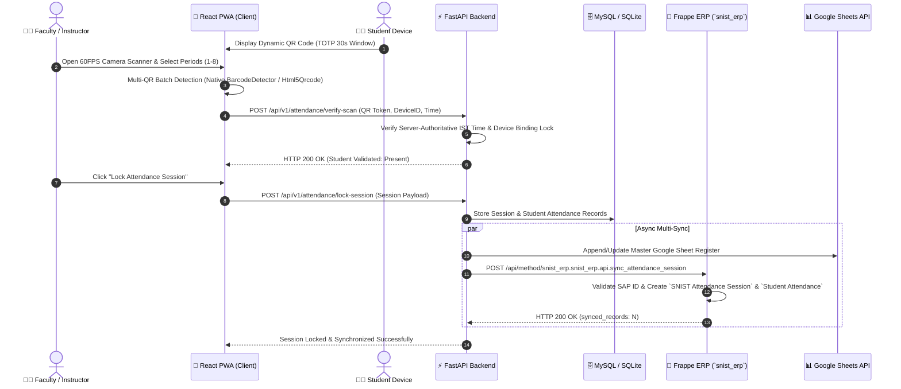
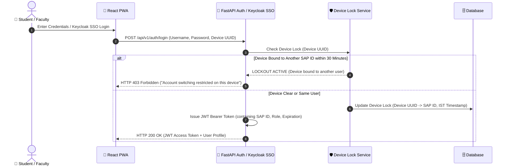
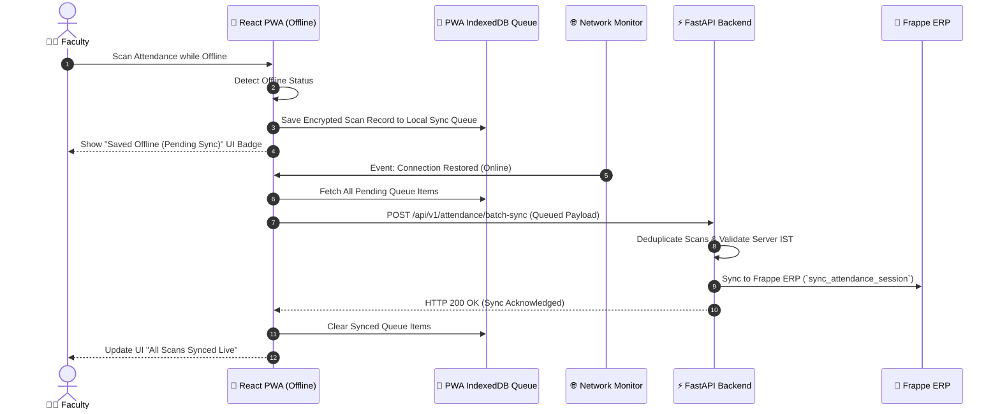
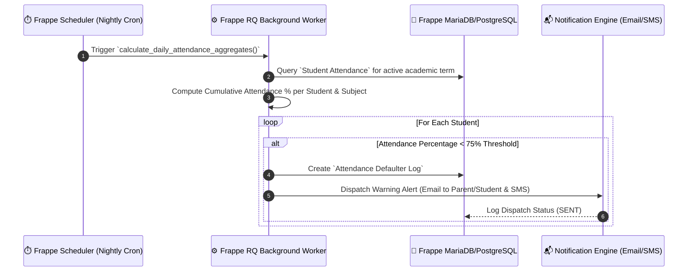
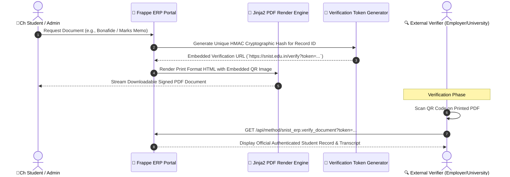
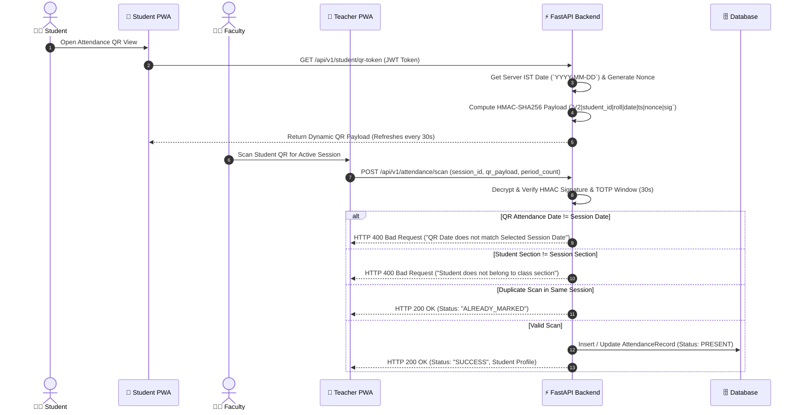
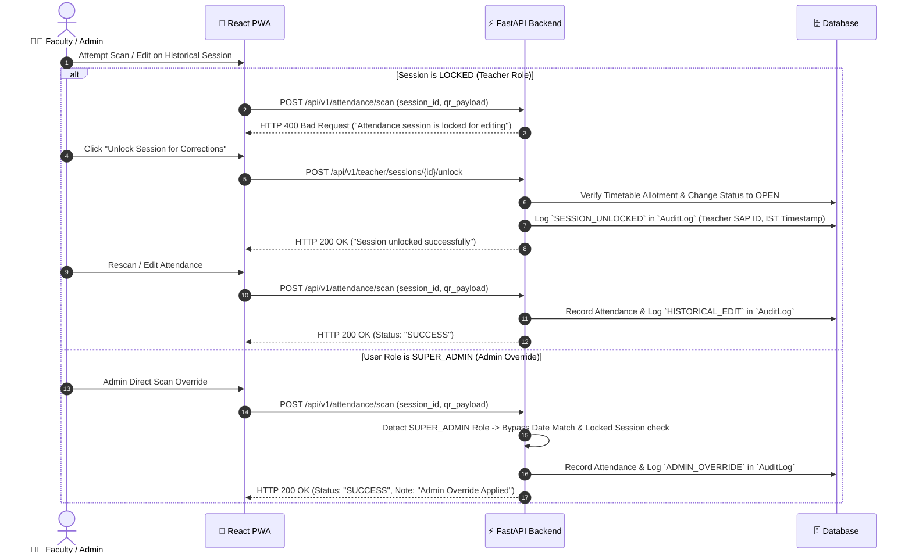
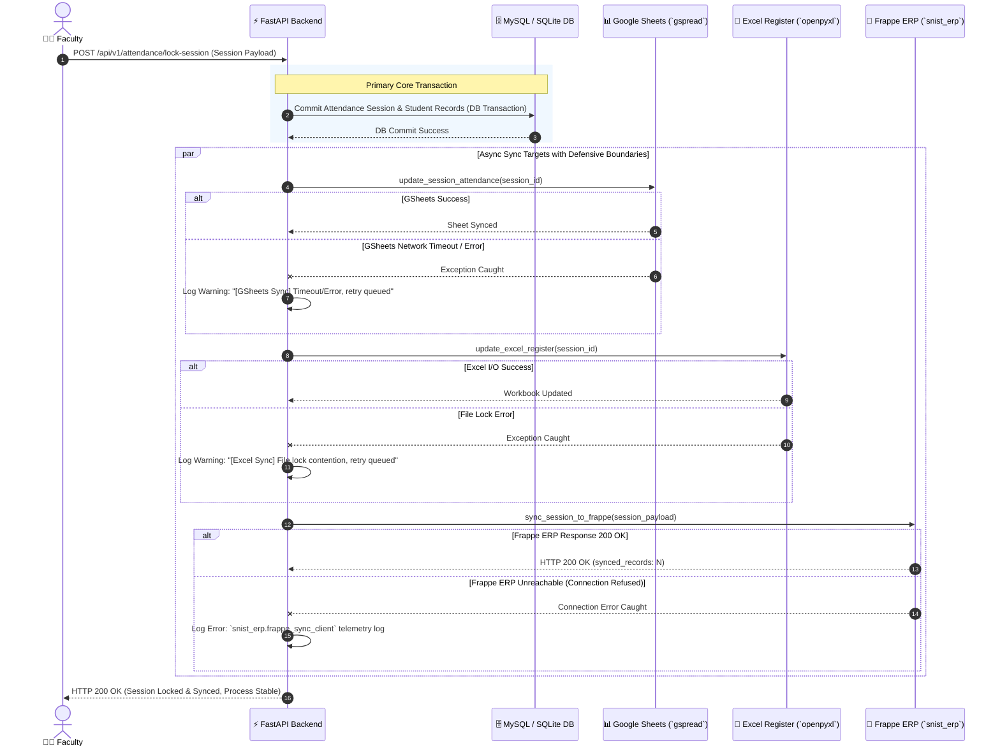

# 🔄 System Workflow & Sequence Diagrams - SNIST ERP & AI Attendance System

## Overview
This document illustrates the end-to-end operational workflows, security checks, background processing, and data synchronization flows across the **SNIST AI QR Attendance System & Frappe ERP**.

---

## 1. End-to-End Attendance Scanning & Locking Flow

This flow describes how a faculty member initiates a session, scans student dynamic QR codes, locks the session, and triggers multi-target synchronization (FastAPI $\rightarrow$ Frappe ERP $\rightarrow$ Google Sheets & Excel).

---

## 2. Authentication, Keycloak SSO & Device Binding Lock Flow

This flow enforces institutional security, Keycloak OAuth2 / JWT authentication, server-authoritative time verification, and the 30-minute device lock policy.

---

## 3. Offline PWA Queue & Sync Recovery Flow

This flow details how the system gracefully handles campus network drops and synchronizes queued records once connectivity is restored.

---

## 4. Frappe Background Scheduler & Defaulter Alert Trigger Flow

This flow illustrates how Frappe RQ / Scheduler runs nightly background jobs to calculate student aggregate attendance percentages and trigger low-attendance alerts.

---

## 5. Automated PDF Certificate Generation & Dynamic QR Verification Flow

This flow demonstrates how Jinja2 print formats generate official documents (Hall Tickets, Marks Memos, Transfer Certificates) with dynamic QR tokens for instant external verification.

---

## 6. Date-Bound Dynamic Student QR Code Generation & Scanning Validation Flow

This flow details how student dynamic `V2` QR codes are generated with server-authoritative IST dates, HMAC signatures, single-use nonces, and validated against target attendance sessions.

---

## 7. Historical Attendance Unlock, Edit & Admin Override Flow

This flow details how faculty unlock locked historical sessions to edit past attendance under full audit trail logging, as well as the administrative override workflow executed by Super Admins.

---

## 8. Defensive Multi-Target Real-Time Sync & Graceful Degradation Flow

This flow details how attendance session locks trigger parallel multi-target synchronization (Database, Google Sheets API, Excel Register, and Frappe ERP REST endpoint) with strict exception boundaries to prevent server crashes.

